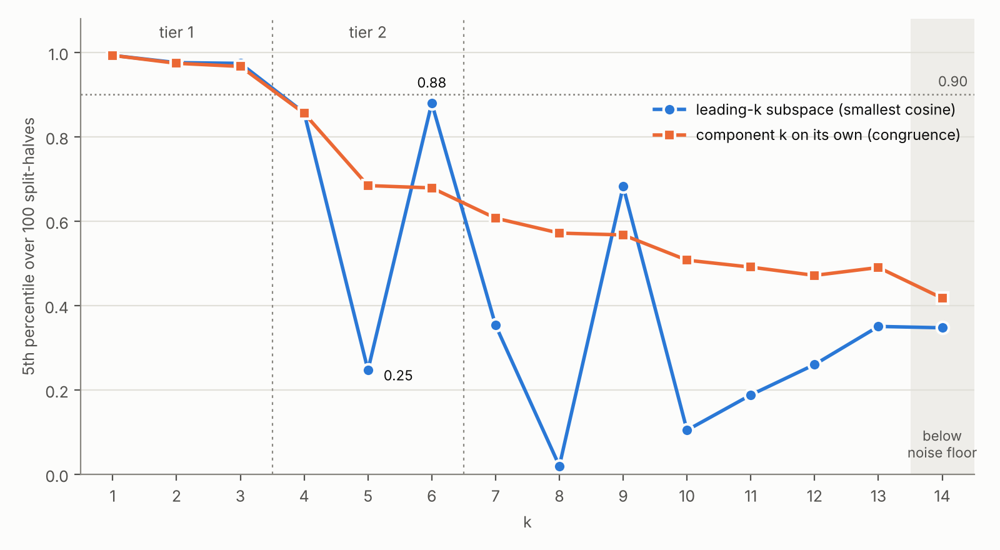

## 1. Introduction

Existing research on which occupations artificial intelligence might replace has generally not treated the question as a multidimensional one. Many studies examine a range of underlying data and then collapse their results into a single index, representing how substitutable a given occupation is by AI relative to others. (A note on terminology: this paper avoids the term "exposure", which leaves unresolved whether what is being measured is substitution or human–AI collaboration. "Substitution" is used throughout, except where another author's measure is named.)

Such an approach overlooks the fact that whether AI can substitute for human labour in a given occupation is determined by several factors at once, and that these factors need not point in the same direction. Software engineering illustrates the difficulty. Parts of the work are highly structured and can be handled by current systems without scaffolding, which makes them readily substitutable. Other parts are context-rich and require planning, and continue to depend on experienced engineers. Whether any particular piece of software engineering work is replaced by AI therefore depends on the balance between two conflicting influences. Reducing the substitutability of software engineers to a single index cannot easily represent this, and studies frequently arrive at opposing conclusions when they are in fact capturing different factors. This is one reason why research on AI substitution remains contested and difficult to reconcile, even where individual measures fit observed data well.

This paper attempts to identify the full set of factors bearing on whether an occupation is substitutable by AI, and to characterise them comprehensively. Against this, the advantage of a one-dimensional index is that it is intuitive, whereas complex models involving many variables are often hard to interpret. To address the first problem while preserving that intuitive quality, the paper seeks to derive a low-dimensional subspace of occupational characteristics, in which an occupation's position along each axis determines where it sits within that space. Two- and three-dimensional slices of this space can then be visualised, so that decision-makers in economic policy can continue to read off the relative position of each occupation directly while also recognising the complexity of the question.

The paper further seeks to identify labour-market variables, beyond the characteristics of the work itself, that may impede substitution, such as union density and occupational mobility. These are intended to help address the question of substitution versus collaboration, to account for the gap between measures of substitutability and observed employment outcomes, and to provide a basis for policymakers concerned with employment stability.

The result is a three-axis description of occupational structure — physical intensity, judgement, and person-facing work — together with four labour-market variables that lie outside it: union coverage, education and training requirements, self-employment and employment size. We offer it as a model in a specific sense: a coordinate system in which occupations, and the substitution measures built on them, can be located. Its axes are established, their stability tested and their meanings validated against an external classification; what it does not supply is the function by which a position in the space translates into displacement risk. Displacement is some function of the three axes and of those four variables, and this paper fixes the arguments of that function rather than its coefficients. That is a weaker claim than a substitution index makes, and one that does not expire when the next model is released.

## 2. Method

The most direct way to identify the factors governing whether AI can substitute for human labour in an occupation would be to measure AI performance on tasks representative of that occupation, and to combine those measurements with data on the occupation itself. The most advanced work of this kind is GDPval (Patwardhan et al., 2025), in which practitioners drawn from the occupations concerned both set the tasks and graded the results.

Where such measurement is not available, two practices are common. One is to score AI performance directly on a rating scale; the other is to ask a generative model which tasks it could perform. Both yield occupation-level numbers at low cost, but neither produces a quantity that can readily be verified against an external standard, and results of this kind have been shown to vary with the model performing the rating and with the phrasing of the prompt. We have neither the resources to commission expert assessment on the scale GDPval required, nor any wish to introduce judgements of our own in its place.

We therefore restrict the analysis to the demand side. We take the occupational feature data published in O\*NET, together with a set of labour-market variables attached to occupations, and recover from them the principal factors along which occupations differ. No measurement of AI enters at any point.

A considerable body of work has examined the structure of the O\*NET occupational space. However, all of that work relies on prior assumptions. Some have fixed the number of dimensions in advance, according to an economic theory to be tested or to the external data the result was to be matched against; the theory is then confirmed, but the structure of the data itself is left unexamined. Some transform the input before analysis — binarising continuous ratings, for instance — which may sharpen or weaken the structure that emerges and introduces a particular bias, even where the validity of the final result is unaffected. Others build weighted aggregates in which the weights are heuristic and cannot be verified against anything, although the resulting indicator may still point in broadly the right direction.

We take an alternative approach. We apply unsupervised analysis — clustering and
principal component analysis — directly to the published feature ratings, with no
structure specified in advance, in order to recover the shape of the space
itself; everything that follows is conducted on the structure so obtained.

The purpose of proceeding this way is to let the data disagree with us. A
structure fixed in advance can only be confirmed or rejected; one recovered from
the data can also be surprising, and the surprises are where the contribution
lies. We therefore treat each axis the decomposition returns as a claim to be
checked against what is already known. Where the recovered structure reproduces a
distinction the literature already draws, that is evidence for the distinction,
arrived at without having assumed it, and it is also evidence that the procedure
has found structure rather than noise. Where the recovered structure cuts across
the received account, we take the discrepancy as the finding rather than
smoothing it over: we ask which of the two the data supports, what the received
account was tracking instead, and what follows for how substitution should be
measured.

### 2.1 What this design cannot do

Two consequences follow, and we state them plainly.

The first is that this paper contains no evidence about what AI can or cannot do. What it offers is a framework — an account of which variables bear on the question and of the space those variables form — rather than an estimate of substitution risk for any occupation. The function mapping a position in that space to a probability of displacement is not estimated here; the paper fixes the arguments of that function and leaves its coefficients to work that can measure capability.

The second consequence is a compensating one. Capability estimates have a short shelf life and must be revised as systems improve, whereas the structure of occupational features changes far more slowly, and the axes along which occupations differ are likely to remain interpretable across successive revisions of any capability measure. A framework specified on the demand side can therefore accommodate new capability evidence without being rebuilt. We would not claim that occupational requirements are fixed — they are themselves reshaped by technology, and O\*NET revises its ratings accordingly — only that they move on a slower timescale than the capabilities being measured against them.

The cost is equally plain. An analysis conducted on this side of the problem cannot say which occupations are most substitutable at any given moment, and cannot be updated to track a changing frontier. What it can do is establish the terms in which such a judgement would have to be expressed.

A further limitation runs deeper than the absence of capability measurement. The requirements an occupation places on a human worker are not necessarily the requirements it places on an AI system. Capabilities that are distinct for people may be a single capability for a model — O\*NET treats law, medicine and marketing as separate knowledge elements because each is acquired through separate and lengthy human training, whereas for a model trained on a broad corpus these are closer to one capability applied at differing densities of training data. Conversely, work that makes almost no demand of a person, such as playing through a game to test it, may lie beyond what current systems can do. There is no reason to expect the dimensions along which human requirements vary to coincide with the dimensions along which machine difficulty varies, and a space recovered from human requirements may therefore organise capability evidence only loosely once such evidence is introduced.

We note that this difficulty is not specific to the present paper. No study to date has recovered the structure of AI capability empirically in the way that occupational features have been recovered here; capability is generally represented either by a single index or by a set of domains specified in advance. Until the capability side has a measured structure of its own, the correspondence between the two spaces cannot be assessed in either direction. We record this as a limitation of the approach and as an open question for the field, rather than as one this paper resolves.

## 3. Literature

**Measures of substitution.** A first generation established that the question could be quantified and fixed O\*NET as the substrate for almost everything since (Frey and Osborne, 2017; Brynjolfsson et al., 2018; Felten et al., 2018, 2021; Webb, 2020 [WP]). Capability was inferred indirectly — from patent text, from benchmark results, from crowd-sourced matching to ability scales — and aggregated to occupations by weights the authors judged reasonable. Each produced a single score. Their disagreement is the relevant fact here: correlations of these measures with wages run from −0.56 to +0.54, so they are not noisy estimates of one quantity but estimates of different ones. The approach has not been superseded so much as left available: independent work continues to appear in which both the task scores and the aggregation weights are assigned by the author, validated against external data but leaving no structure a reader can test (for instance, 2026 [WP]).

A second generation made the capability judgement explicit and reproducible. Eloundou et al. (2024) apply a common rubric to O\*NET task statements, separating what a model can do unaided from what it can do with additional software, and report inter-rater agreement. Work in this group also began to set the resulting scores alongside the characteristics of the workers holding the occupations: the Pew Research Center's analysis (Kochhar, 2023) scores O\*NET work activities and skills, matches 873 detailed occupations to 485 in the Current Population Survey, and crosses the result with wages, education, gender, race and industry, finding the most exposed occupations paying \$33 an hour against \$20 in the least exposed; the US Treasury (2024) analysis follows a similar route. These are the closest precedents for the second question asked here, though they describe the labour-market characteristics of exposed occupations rather than asking whether those characteristics carry information the feature data does not. The capability side improves throughout; the output remains one number per occupation.

Frontier work advances on one of two fronts. GDPval (Patwardhan et al., 2025 [WP]) measures rather than judges: practitioners author the tasks and grade the deliverables. Its coverage is correspondingly bounded, since a task must yield a reviewable artefact, which excludes most embodied work by construction. The OECD (2026 [WP]) advances instead on structure, assessing AI capability and occupational demand separately on a common five-level scale across nine domains and publishing the gap for each domain as well as the total. That measure is the closest in spirit to the present paper, and its own caution is our point of departure: the total index "should be interpreted alongside the underlying domain-specific gaps rather than as a self-sufficient measure." Separately, the Anthropic Economic Index (Handa et al., 2025 [WP]) records what AI is actually used for rather than what it can do, and is the only public source distinguishing automative from augmentative use.

**The task framework.** Autor, Levy and Murnane (2003) organised this literature around two crossed distinctions, manual against cognitive and routine against non-routine; Deming (2017) established the wage return to social skills. Both bear on how the axes recovered below should be read, and Section 5.5 returns to them.

**Prior attempts to analyse the structure of O\*NET.** Alabdulkareem et al. (2018) analysed O\*NET with the skills as objects rather than the occupations. They normalised the occupation-by-skill matrix by revealed comparative advantage and binarised it, and found two communities — one social and cognitive, one sensory and physical. We follow that work in seeking structure rather than imposing it, and depart from it in two respects: we do not binarise, since thresholding discards the intermediate values that distinguish occupations differing by degree, and we take occupations rather than skills as the objects, because displacement attaches to occupations.

The closest methodological precedent is Lise and Postel-Vinay (2020), who run principal component analysis on over two hundred O\*NET descriptors, retain the first three components, and recombine them to satisfy three exclusion restrictions — that mathematics reflects only cognitive requirements, mechanical knowledge only manual, and social perceptiveness only interpersonal — stating that the resulting labels rest on those restrictions. The procedure is ours; the object is not. Their components are an input to a structural model of sorting, and the properties of the reduction are accordingly left unexamined. The number of components is fixed at three and no test of that number is reported, nor eigenvalues, variance shares, or any diagnostic of stability; the authors note that for a one-dimensional variant of their model they remain agnostic as to what the first principal component measures. The estimation is run on a worker-week panel of a single survey cohort, so occupations enter weighted by employment and occupations nobody in that cohort held are absent; the Level rather than the Importance scale is used; and descriptors that could not be assigned in advance to one of the three target concepts are dropped before the decomposition. Each of these is appropriate to their purpose and consequential for ours. Benzell et al. (2019 [WP]) reach eight factors on similar data by pruning items until each loads cleanly on one factor. Neither tests whether the reported components reproduce on an independent subset of occupations.

**Labour-market position.** Whether a technically feasible substitution is carried out depends on more than capability, and a separate literature has established that the relevant variables are neither negligible nor recoverable from the content of the work. Svanberg et al. (2024 [WP]) find that cost and firm size leave most technically automatable vision work unattractive to automate, with the binding constraint being that most firms are too small to justify the fixed cost. Weeden (2002) maps five institutionalised closure devices — licensing, educational credentialing, voluntary certification, association representation and unionisation — onto 488 occupations, and finds that the returns to them are not tightly linked to the complexity of the occupation's knowledge base: institutional position and occupational content are largely separate things, which is the proposition our treatment of the labour-market variables assumes and tests. The direction of the institutional effect on substitution, as distinct from wages, is unsettled. Collective agreements may restrain what an employer does with a technology, but by attaching rents to a job they may equally invite its automation (Acemoglu and Restrepo, 2024), and minimum wage increases have been shown to accelerate the automation of automatable work (Lordan and Neumark, 2018). We therefore treat these variables as a dimension to be located rather than as a protective factor to be assumed.

**Mechanisms below the occupation.** A further literature works at the level of tasks within a job, and it is precisely the level our data cannot reach, since O\*NET publishes one profile per occupational code. Autor and Thompson (2025) show that when tasks are automated the sign of the wage effect depends on whether the removed tasks were the expert or the inexpert part of the job: automation that strips away inexpert tasks raises wages and lowers employment, and automation that strips away expert tasks does the reverse. A share-of-tasks-exposed measure therefore cannot determine the direction of the effect, however accurately it is estimated. Freund and Mann (2026 [WP]) reach a compatible conclusion from task bundling, and report that dispersion of outcomes within an occupation grows with its exposure, so an occupational average is least informative exactly where exposure is highest. Hampole et al. (2025 [WP]) find that occupational outcomes are summarised not by one statistic but by two, the mean of task exposure and its concentration, which offset one another. We record these results as a limit on what any occupation-level description can deliver, and return to them in Section 6.

**Observed outcomes.** The clearest employment evidence to date is not of displacement. Brynjolfsson et al. (2025 [WP]), using a monthly payroll panel of several million US workers, find no widespread economy-wide job losses, but report that employment of workers aged 22 to 25 in the most exposed occupations stands well below where it would be had it kept pace with their less exposed peers, with no comparable gap for experienced workers. The adjustment runs through reduced hiring rather than increased separations — separation rates in exposed occupations fell at least as fast as elsewhere — and the declines concentrate in occupations where AI usage substitutes for labour rather than complementing it. The authors present these as descriptive facts rather than causal estimates, and note that the estimates attenuate when occupational education is controlled for, that some divergence predates the technology, and that their sample over-represents large firms and exposed occupations. Others reach different conclusions on different data: Humlum and Vestergaard (2025 [WP]) find no significant effect on earnings or hours in Danish administrative data, and Lambert and Schindler (2026 [WP]) attribute much of the entry-level pattern to remote work. Two features of this evidence bear on what follows. The signal is a within-occupation one, at the entry level, which is the level our data cannot represent; and it is about hiring rather than employment stocks, which is the margin on which institutional protection of incumbents would be expected to leave occupational totals unchanged.

## 4. Data

### 4.1 O\*NET and the data we use from it

The analysis needs two kinds of data: features of the occupations themselves,
and the position each occupation holds in the labour market. O\*NET is our
largest single source. This section introduces it briefly and sets out which of
its data we use. Section 4.2 describes in more detail how we prepare the
occupational features, and Section 4.3 how we obtain the labour-market
variables, most of which O\*NET does not contain.

O\*NET is the successor to the *Dictionary of Occupational Titles*, maintained for
the US Department of Labor. It describes roughly nine hundred detailed
occupations on several hundred numeric scales, rated by job incumbents surveyed
within each occupation, by occupation experts and by trained occupational
analysts. We use release 31.0, published in August 2026. Its organising scheme,
the Content Model, is arranged in three parts — the worker, the job and the
market — each divided into areas, and the areas into the blocks of descriptors
that O\*NET publishes (Figure 1).

```{=html}
<figure class="content-model">
  
  <figcaption><b>Figure 1</b> — the O*NET® Content Model. Source: National Center
  for O*NET Development, O*NET Resource Center. Used under the CC BY 4.0
  license.</figcaption>
</figure>
```

We take the blocks in turn, quoting O\*NET's definition of each and saying
whether we use it and why. The definitions are quoted from O\*NET OnLine or,
where it gives none, from the Content Model page of the O\*NET Resource Center
(National Center for O\*NET Development, n.d.-a, n.d.-b). Five blocks enter the
feature matrix.

**Abilities.** "Abilities are enduring attributes of the individual that
influence performance." The ratings are made by trained occupational analysts
for every occupation. O\*NET groups abilities into cognitive, psychomotor,
physical and sensory. The block is a direct rating of the capacities an
occupation demands, and so bears directly on which capacities a system would
need in order to do the work.

**Skills.** The Content Model lists three kinds. "Essential skills are skills
you need for most jobs, such as reading, writing, math, and learning";
"transferable skills are skills you can use across different jobs, such as
communication, problem solving, and team work"; and software skills are "using
specific programs and applications for work tasks." Trained occupational
analysts rate the essential and transferable skills of every occupation;
together they hold thirty-five elements, which we use as one block. Where an
ability is enduring, a skill is
acquired, which bears on how quickly an occupation could be re-staffed or its
workers retrained if part of the work were automated. Software Skills are
recorded differently: as examples of software linked to each occupation, flagged
where employer job postings frequently ask for them, but not rated. They are not
used in the present analysis.

**Knowledge.** "Knowledge is organized sets of principles and facts applying in
general domains." The ratings come from a survey of incumbents for about 72
percent of the occupations analysed here, from occupation experts for about 27
percent, and, for the remaining nine, from provisional analyst ratings that
O\*NET publishes until a survey is completed. There are thirty-three domains, from administration and
management to law, medicine and engineering. The block bears on substitution
with a caveat we state rather than resolve: what O\*NET treats as separate
domains, because each takes a person years to acquire, may not be separate for a
model trained on a broad corpus. It still discriminates occupations well, which
is what it is used for here.

**Work Activities.** "Work activities are general types of job behaviors
occurring on multiple jobs." The raters are the same as for Knowledge. O\*NET
groups them into information input, mental
processes, work output and interacting with others. We use the general level,
the forty-one activities rated for every occupation; the intermediate and
detailed levels below it classify task statements and are not rated. Of the
five blocks this is the closest to what is actually done rather than to what the
doer is like, and it is therefore the block most directly comparable to the
task-level measures the substitution literature is built on.

**Work Context.** "Work context is physical and social factors that influence
the nature of work." The raters are the same as for Knowledge. O\*NET groups
it into interpersonal relationships, physical
work conditions and structural characteristics of the job, such as its pace and
the consequences of its decisions. It carries what the other blocks omit:
whether the work is done in person, outdoors, under hazard, under time pressure,
in contact with the public. These constrain what can be delegated to a system
independently of how difficult the work is, and without this block an
occupation's physical setting is invisible to the analysis.

The other blocks are not used, for reasons that differ in kind.

**Career Interests and Work Styles.** Career Interests comprise Career Interest
Types, "broad types of work you enjoy", and Specific Interest Areas, "work
activities you enjoy"; "work styles are personality tendencies exhibited at
work, which can affect how well someone performs a job." Both describe what suits
a person rather than what the work requires, and both are excluded because they
are not observations. O\*NET produces Work Styles and Specific Interest Areas by
what it calls a hybrid artificial intelligence–expert method, and Career
Interest Types by a machine learning–expert method. They are model outputs
rather than measurements of the occupation, and including them would put a
model's judgement inside a matrix intended to hold only measured features.

**Occupation-Specific Info.** "Details about a specific job": each occupation's
title, description, job titles and tasks, where "tasks are specific work
activities that can be unique for each occupation." This is descriptive text
that documents an occupation for reference rather than measuring it, and it is
not used.

**Education, training, experience and licensing.** Education is the "education
typically required to perform a job", Experience and Training "the amount of
related work experience and training needed for a job", and Licensing the
"required licenses, certifications, or registrations needed to perform a job."
O\*NET publishes education, training and experience as the distribution of
answers given by respondents in each occupation; for licensing, the nearest
measures in the database are two importance ratings, of a job-related
professional certification and of an apprenticeship. We take the view that this
group is not a description of the work, and introduce it in Section 4.3 with the
other labour-market variables and the market part of the Content Model; Section
5.5 gives the evidence that led us there.

### 4.2 Scales and missing values of the occupational features

O\*NET publishes most of the blocks we keep on more than one scale, so the first
choice is which to keep. Work Context is the small case: it is published on a
Context scale (CX) and, for a few items, on a Category scale (CT). We keep CX
throughout. The two CT items duplicate items already present on CX, carry 0.5
percent of the variance, and add a second unit of measurement to the block for
nothing.

Four of the blocks — Skills, Abilities, Knowledge and Work Activities — are
published on two scales at once. Importance records how consequential a
descriptor is to the occupation; Level records how much of it the work demands.
Retaining both would be the natural default, and the four blocks would then
occupy 322 columns rather than 161. We retain Importance only, for three
reasons, in order of weight.

The first is precision. A Level rating is far more often too imprecise to use
than the Importance rating of the same element. O\*NET marks such ratings with a
Recommend Suppress flag: for survey data when fewer than ten people responded,
when fewer than fifteen responded and all gave the same answer, or when the
standard error exceeds half the rating itself; for analyst data when the
standard error exceeds 0.51. In release 31.0 the flag falls on 6,168 of the
146,551 Level rows in the four blocks, and on 69 of the same number of
Importance rows. It is concentrated where the analysis would feel it most:
16.3 percent of Knowledge Level ratings are flagged, against 0.2 percent of
Knowledge Importance ratings, and 2.9 percent of Work Activities Level ratings,
against almost none on Importance. Keeping Level would put several thousand
ratings that O\*NET itself recommends withholding into the matrix.

The second is meaning. O\*NET also marks a Level rating Not Relevant when the
element barely matters to the occupation: when more than three quarters of
incumbents rate its importance as "not important", or when no more than two of
the analysts rate its importance 2 or higher. The flag falls only on Level rows:
on 16 percent of them in Abilities, 11 percent in Skills, 20 percent in
Knowledge and 3 percent in Work Activities. A flagged rating still carries a
number, at or near the bottom of the scale — the median is 0 in Abilities and
0.34 in Knowledge — but O\*NET advises showing users that the level is not
relevant rather than showing the number. It is therefore neither a measurement
the publisher stands behind nor a missing value, and the data offers no ground
for preferring one treatment of it over another, whether the published number,
zero, or a gap.

The third is redundancy. Across the 161 elements, an element's Importance and
Level correlate across occupations at a median of 0.94, and above 0.9 for three
quarters of them; the whole Level matrix can be predicted from the Importance
matrix by cross-validated ridge regression at R² = 0.90. Level would almost
double the width of the matrix for about a tenth of new information. Appendix A
reports what the analysis gives when Level replaces Importance and when the two
are used together.

**Missingness.** Of the 1,016 O\*NET-SOC codes that release 31.0 lists, 105 have
no ratings in any block and one is rated in only two of the five; every other
occupation is complete in all five blocks, with not a single scattered gap.
Missingness in the feature data is therefore a matter of whole rows, and what
needs explaining is which rows are absent and why. The composition of the 105
is not arbitrary, and the SOC coding system itself identifies most of it.

Ninety-four of the 105, or 89.5 percent, are not occupations in the sense the
survey needs. Seventy-four are artefacts of the classification. The SOC
reserves, within each broad group, a detailed code whose four-digit portion ends
in 9 for the "All Other" residual: `51-3099`, `43-4199` and the like collect the
scattered jobs that belong to a group without warranting a line of their own. A
residual bucket is heterogeneous by construction, so there is no coherent
occupation for O\*NET to survey and it does not survey one. The military major
group, `55-xxxx`, nineteen codes, is likewise outside the civilian survey frame
in its entirety. The last is legislators, who are elected rather than employed.
Dropping these is not a judgement about which occupations matter but the absence
of anything to measure.

The remaining eleven are ordinary detailed occupations, created or split in the
2018 SOC revision, which O\*NET's rolling survey has not yet reached; emergency
medical technicians, separated from the former combined code for technicians and
paramedics, are an example. Their descriptor rows are empty because collection
has not caught up, not because the occupations are marginal. A twelfth code from
the same revision, calibration technologists and technicians, is rated on Work
Activities and Work Context but not on Abilities, Skills or Knowledge.

We drop these rows rather than fill them. A code is split off because its work
differs from that of the code it came from, and the parent is the only donor
available; filling the new occupation from it would write that difference back
out of the data and introduce a large bias into exactly the occupations
concerned. Scattered gaps could be filled from a column median or a neighbouring
occupation, with little at stake in any one cell, but an occupation with no
measurements at all leaves nothing to anchor a fill. The loss is also small:
twelve of the 922 ordinary detailed occupations, 1.3 percent.

**910 detailed occupations remain, and this is the analysis set throughout.**
Their 216-column feature matrix is complete as published, and the analysis rests
on no imputed feature value. The few Importance and Context ratings that O\*NET
flags for low precision, 69 and 121 rows respectively, are kept as published.

The matrix is wide for its length, 910 occupations against 216 variables, and
the methods are chosen with that in mind. The ratings are heavily collinear, so
the effective dimension of the matrix is far below 216 (Section 5.3), and what
the width costs depends on the method. For principal component analysis it
costs little: the estimand is the covariance structure rather than a set of
coefficients, and collinearity concentrates that structure in a few directions.
For clustering, many dimensions can blur distances until every occupation looks
about equally far from every other, hiding groups that exist; Section 5.2 rules
this out by repeating the clustering on the leading ten components. For
regression, the width does bite. With 216 predictors against 910 observations,
ordinary least squares fits the training folds almost exactly and generalises
arbitrarily, returning large negative cross-validated R² values. The regressions
of Section 5.5 therefore use ridge, whose penalty is what makes the estimate
meaningful in this shape, with the scaler fitted inside each fold.

The final matrix, of 910 occupations, is as follows.

**Table 4.1 — The final matrix**

| block | scale | columns | missing cells | filled |
|---|---|---|---|---|
| Work Context | Context | 55 | 0 | none |
| Abilities | Importance | 52 | 0 | none |
| Work Activities | Importance | 41 | 0 | none |
| Skills | Importance | 35 | 0 | none |
| Knowledge | Importance | 33 | 0 | none |
| **Total** | | **216** | **0** | none |

### 4.3 The labour-market variables

The Content Model already has a place for the labour market. Its third part,
the **Market** — labour market information and occupational outlook — sits beside
the worker and job descriptors of Section 4.1, which is O\*NET's own statement
that where an occupation stands in the labour market belongs to the description
of it. What that part does not have is data of its own. The downloadable
database distributes no file for it. O\*NET OnLine fills it at display time from
the Bureau of Labor Statistics, under the line "Source: Bureau of Labor
Statistics 2025 wage data and 2024–2034 employment projections", and shows
four national figures: a median wage, an employment count, a growth rate
reported as a band, and a count of projected openings.

Going to those sources directly is therefore not a departure from O\*NET's
scheme but the same numbers at the resolution the question needs. A median wage
cannot say whether pay within an occupation is tightly or widely spread. A
single growth band cannot separate workers who leave the labour force from
workers who move to another occupation, and Section 5.5 turns on that
distinction.

Each variable is taken in turn — why it might bear on whether a technically
feasible substitution is carried out, where the numbers come from, whether their
coding lines up with O\*NET's, and what is missing from them.

**Education, training and experience** *(O\*NET, Worker and Experience
Requirements, incumbents or occupation experts).* This is the one variable here
that O\*NET itself collects: for each occupation, the share of respondents
reporting each ordinal level of required education, prior related work
experience, on-site or in-plant training and on-the-job training. It sits in
this section rather than in Section 4.1 because, in our reading, it does not
describe the work but what holders of the job have — which is where
credentialing and licensing enter the data. Entry thresholds are institutional
rather than technical and can hold even where the work is substitutable, and a
licensed occupation with a substitutable task profile is exactly the case the
paper wants to be able to see. Section 5.5 supplies the empirical half of the
argument: what preparation an occupation demands is not recoverable from what
the work requires. Because the block is O\*NET's own, no join is needed. Since
release 30.3 it is published as two files, Education and Training and
Experience.

The education scale needs one further step. Release 31.0 publishes required
education on two scales: RL, the scale of earlier releases, for 758 of the
occupations analysed, and RQ for the other 143, never both for one occupation.
RQ appears only among occupations whose education data were collected for this
release, and its category labels are the response options of the Education and
Training questionnaire as revised in February 2025. Its twelve categories match
RL's in number and order. Ten are worded identically; two are reworded, First
Professional Degree becoming Doctor's Degree, Professional Practice (such as a
J.D. or an M.D.), and Doctoral Degree becoming Doctor's Degree,
Research/Scholarship (such as a Ph.D.). We merge the two scales category by
category into one. The evidence that this is safe comes from the 121
occupations that were on RL in release 30.2 and are on RQ in 31.0. Their mean
education level moves by −0.08 of a category, with a standard error of 0.07,
and their distributions move no further than the training and experience
distributions of the same occupations, which stayed on unchanged scales: a
median distance of 0.29 against 0.35. One change is systematic. The share in
category 10 falls from 1.4 percent to zero once the category is described as a
doctorate rather than a first professional degree; post-secondary certificates
and some college courses also lose about two percentage points each, at about
two standard errors. We record these rather than correct for them.

Nine of the 910 occupations have no rows in either file: 333 cells, absent as a
whole block rather than scattered. They are the nine whose descriptor ratings are
still provisional analyst ratings, which come without the respondent
distributions this block reports. No cell is missing anywhere else. Two further
items in these files, the importance of a job-related professional certification
and of an apprenticeship, are published for only 683 of the 910 occupations and
are not used.

**Wages.** The wage is the price of the labour a substitution would replace,
and so sets the return to replacing it; the spread of wages within an occupation
indicates whether the code holds one job or several, which bears on whether an
occupation-level substitution measure means anything for the people in it. We
take the national May 2024 Occupational Employment and Wage Statistics: mean,
median and the tenth, twenty-fifth, seventy-fifth and ninetieth percentiles of
annual pay. OEWS keys on the six-digit SOC, which maps one to one onto
O\*NET-SOC codes once the decimal extension is truncated, so the join loses no
information; where several O\*NET variants share a six-digit code — the
specialisms under Physicians, for instance — each variant receives the same
value, which is a property of the published data rather than of our handling.
Coverage is 96.2 percent at the tenth percentile and falls to 90.5 percent at
the ninetieth, and the two causes of that gap are different in kind.

Thirty-five occupations have no annual wage figure of any kind. They do not look
like a random thirty-five: they arrive in families — the three buyers and
purchasing agents codes, the two appraisers codes, the two counsellor codes, two
special education teacher codes, the six clinical laboratory technologist and
technician codes, home health aides with personal care aides, the two teaching
assistant codes, tour guides with travel guides, three assembler codes, three
first-line supervisor codes — which is the signature of OEWS publishing at a
broader SOC line than the one O\*NET rates. Four of the thirty-five are different
again: actors, dancers, musicians and singers, and disc jockeys outside radio
have an OEWS employment figure but no annual wage, work in those occupations
being too irregular for an annual figure to be published.

The second cause is top-coding, and it runs the other way: the occupation is in
OEWS and the value is suppressed because it exceeds the cap OEWS places on
annual wages, \$239,200. The suppression is nested and tells its own story about
the top of the distribution. The ninetieth percentile is suppressed for
fifty-one occupations — chief executives, most managerial codes, lawyers,
physicists, airline and commercial pilots, the dental and physician
specialisms; the seventy-fifth for twenty-five, by which point the managers are
down to the two chief executive codes and almost everything left is medicine;
and the median for eighteen, all of them physician or dental specialisms, where
more than half of all holders earn above the cap. Missingness of this kind
carries information: it states that the true value lies above \$239,200.

**Employment.** Employment is the scale of any displacement, and it is also a
control: a substitution measure that correlates with occupation size may be
measuring size. It comes from the same OEWS release and joins the same way.
Thirty-one occupations have no employment figure, and they are the same
occupations that have no wage, less the four — actors, dancers, musicians and
singers, and disc jockeys — for which OEWS reports employment but not annual
pay.

**Union coverage.** A collective agreement can constrain what an employer may
do with a technology irrespective of what the technology can do, which makes
union coverage the clearest case of an institution standing between technical
feasibility and observed displacement. We take the share of employed workers
covered by a union contract from the 2024 Current Population Survey. This is the
one variable whose coding does not line up. The CPS occupational classification
is coarser than the SOC: roughly 450 distinct CPS classes back the 880 O\*NET
occupations that can be matched, so the value is broadcast, and groups of
occupations share a coverage rate. Broadcasting does not bias the value, but it
attenuates any correlation the variable takes part in, and it means the number
should not be read as a statement about the unionisation of a single
occupation. The join runs through the BLS National Employment Matrix crosswalk.
Thirty occupations cannot be matched through it, so coverage is 96.7 percent;
they are the same thirty that are absent from the projections tables below.

**Occupational prestige.** Social standing may protect an occupation
independently of its technical content. We take the Occupational Prestige Ratings project.
Several rated job titles can fall under one six-digit SOC, and where they do the
ratings are averaged. Fifty-four occupations are unrated, almost all of them
detailed management titles the project did not cover; coverage is 94.1 percent.

**Separation rates.** How readily workers leave an occupation says how far it
can shed labour without dismissals, which is where displacement has in practice
been observed first, and the two ways of leaving are not the same event. We take
both from table 1.10 of the BLS Employment Projections: the labour-force exit
rate, the projected annual share of workers who leave employment altogether, and
the occupational transfer rate, the share who move to a different occupation.
The table keys on the six-digit SOC. Thirty occupations are absent from it;
coverage is 96.7 percent for both.

**Self-employment.** Where the work is done by the self-employed there is no
employer to make the substitution decision, so the mechanism by which a
technology displaces labour is different in kind rather than weaker. We take the
self-employed share from table 1.2 of the same projections release, on the same
six-digit key. Blanks in that table denote negligible self-employment rather
than an unmeasured quantity, and are read as zero. The same thirty occupations
are absent from this table altogether, and are also set to zero; for them this
is an assumption rather than a reading of the source.

Three further variables are published in the same sources and are not carried
into the analysis, for reasons that are worth recording because two of them are
about redundancy rather than quality. **Occupational openings** correlates 0.89
with employment, so the two are close to one measurement of occupation size;
Section 5.5 is where questions of that kind are settled, and admitting both
there would give size two votes in a regression that has one variable per
mechanism. **Typical education needed for entry**, the BLS categorical
threshold, is recoverable from the ETE distributions at R² = 0.82, and the ETE
distributions are the finer instrument. **Work experience needed** is populated
for only about one occupation in eight and cannot support an analysis at all.
Projections of employment growth to 2034 are excluded on a different ground:
a forecast of an occupation's growth may already embed a judgement about
automation, so relating it to a structure intended to inform such judgements
would be circular.
<!-- TODO (31.0): the 0.89 (openings vs employment) and R2 = 0.82 (typical
education from ETE) were computed on the release 30.2 set. Neither openings nor
typical education is carried into master_31_0.csv, so they need the BLS
projections file; recompute on the 910 occupations. -->

The sources were collected at different dates, and the analysis treats them as
one period. Wages and employment are from May 2024, union coverage from the 2024
CPS, the separation rates are projected annual averages for 2024–34, and the
prestige survey is earlier still — while O\*NET itself revises its blocks on a
rolling schedule, so that different occupations carry different vintages within
the feature matrix as well. This is an approximation, and it is the kind a
cross-sectional design cannot avoid.

**Imputation.** Because the causes of the gaps differ, the treatment differs,
and all of it happens in one script so that every analysis reads the same
numbers. Where a high wage percentile is missing while a lower one is present,
the occupation is in OEWS and the value has been suppressed above the cap; it is
filled at the cap, \$239,200. Filling it at the column median would place a
surgeon below their own tenth percentile, which is not a conservative choice but
an incorrect one. Ninety-four cells are filled this way. Where every wage
percentile is missing the occupation has no anchor, and the six cells take the
column median: 210 cells across the thirty-five occupations. The three wage
ratios are then recomputed from the filled levels rather than filled directly,
which keeps them consistent with the levels and no less than one.
Self-employment is set to zero as described above. Everything else — the unrated
prestige scores, the missing union coverage and separation rates, the nine ETE
rows — takes the column median.

Three considerations bound the risk this introduces. The variables carrying most
of the imputation, the wage percentiles, are compressed to two summary columns
before they are used, so the imputed cells are diluted before they reach any
estimate. None of these variables enters the decomposition at all, so no
imputation decision can be producing the axes. And the imputation is confined to
one step rather than repeated in each script. What it cannot be defended against
is a systematic difference between the occupations a source omits and those it
covers: the median fill assumes absence is uninformative, and for the
thirty-five occupations with no OEWS wage we have no evidence either way.

Standardisation is deliberately not applied at this stage. The ridge regressions
of Section 5.5 fit their scaler within training folds only, and storing
standardised values would carry test-fold information into the training set.

**Transformations.** Three are applied before any variable in this section is
used. Employment spans several orders of magnitude, with a maximum sixty-seven
times its median, and enters as a logarithm. Wages enter as two summaries rather
than nine percentiles — the log of the median as a level, the ninetieth-to-tenth
ratio as a dispersion — because nine near-collinear measurements of one quantity
would otherwise give that quantity nine votes against one for every other
variable. And the highest category of each education, training and experience
scale is dropped, because the categories of a scale sum to 100 and one is
therefore linearly determined by the others; this removes an exact collinearity
and takes the block from 41 columns to 37.

**Table 4.2 — The labour-market variables**

::: {.lm-table}

| variable | why it might bear on substitution | source | what the coding does | coverage and treatment |
|---|---|---|---|---|
| education, training and experience | entry thresholds are institutional, not technical, and can hold where the work is substitutable | O\*NET 31.0, Education and Training and Experience | already on O\*NET-SOC; no join; the RL and RQ education scales merged category by category | 9 occupations absent as a whole block (333 cells) → column median; highest category of each scale dropped, 41 → 37 columns |
| wage level and dispersion | the price of the labour sets the return to replacing it; spread says whether the code holds one job or several | OEWS national, May 2024 | exact on the six-digit SOC; O\*NET variants of one code share a value | 90.5–96.2% by percentile; 94 top-coded cells → the \$239,200 cap, 210 whole-row cells → column median; enters as log median and p90/p10 |
| employment | the scale of any displacement, and a control against measuring occupation size | OEWS national, May 2024 | exact on the six-digit SOC | 96.6%; column median, then logged |
| union coverage | a collective agreement constrains what an employer may do irrespective of what is possible | CPS 2024, via the BLS National Employment Matrix crosswalk | broadcast: ~450 CPS classes to 880 occupations | 96.7%, at reduced resolution; column median; attenuates any correlation it enters |
| occupational prestige | status may protect an occupation independently of its content; also a check on whether an axis is a status measure | Occupational Prestige Ratings project | averaged where several rated titles share one SOC | 94.1%; column median |
| labour-force exit rate; occupational transfer rate | how readily an occupation sheds labour without dismissals, and whether leavers exit or move | BLS Employment Projections, table 1.10 | exact on the six-digit SOC | 96.7%; column median |
| self-employment share | no employer to make the substitution decision, so the mechanism differs | BLS Employment Projections, table 1.2 | exact on the six-digit SOC | 96.7%; blanks mean negligible and the 30 absent occupations are assumed so, both set to zero |

:::

None of these variables enters the decomposition. They are the subject of
Section 5.5, which asks how much of each the feature data can predict, and which
explains there why that question is put to a regression rather than to a
decomposition.


## 5. Analysis and results

### 5.1 Standardisation

Every variable is z-scored — its mean subtracted and the result divided by its
standard deviation — before entering any decomposition or clustering. Both
methods work on variance, so on unstandardised data a variable recorded in large
units would simply have more of it, and the leading component would report which
columns happened to be measured on a wide scale. Z-scoring is the standard
remedy and is not specific to this paper.

It matters more here than usual, because the columns are not on one scale: a
five-point importance rating and a percentage of respondents in an education
category are not commensurable in the first place. Z-scoring is a linear
transformation, so it moves and rescales a variable but leaves its shape, its
rank order and every correlation it takes part in unchanged; the distribution
the decomposition sees is the distribution O\*NET published, in common units.

Standardised matrices are not stored. Each analysis standardises its own, because
the cross-validated regressions of Section 5.5 must fit the scaler within
training folds only, and a matrix standardised once in advance would carry
test-fold information into every estimate built on it.

### 5.2 Do occupations fall into classes?

The reason to expect classes comes from Alabdulkareem et al. (2018), who find
two communities among skills — one social and cognitive, one sensory and
physical. If occupations fell into a few kinds, the substitution question
could be answered kind by kind — identify the exposed kinds — and the analysis
would be simpler. What follows asks the same question of occupations: do they fall into classes? We cluster the 910
occupations by k-means for k from 2 to 10 and measure separation by the
silhouette coefficient, which compares a point's average distance to the other
members of its own cluster against its average distance to the members of the
nearest other cluster. Values near 0.5 and above indicate separated groups;
values near 0.2 indicate a partition imposed on a continuum.

**Occupations do not form groups.** The best silhouette is 0.226, at k = 2, and
it falls as k rises. Repeating the test in the leading ten principal components,
in case distance concentration in 216 dimensions was obscuring structure, raises
it to 0.312 — still far from separation. Repeating it on the RCA-binarised
matrix, which is the representation Alabdulkareem et al. use, gives 0.236.

| k | 216 features | RCA-binarised | first 10 components |
|---|---|---|---|
| **2** | **0.226** | **0.236** | **0.312** |
| 3 | 0.147 | 0.170 | 0.224 |
| 4 | 0.134 | 0.144 | 0.213 |
| 5 | 0.125 | 0.112 | 0.204 |
| 6 | 0.119 | 0.089 | 0.197 |
| 7 | 0.105 | 0.082 | 0.178 |
| 8 | 0.104 | 0.078 | 0.184 |
| 9 | 0.101 | 0.069 | 0.182 |
| 10 | 0.097 | 0.068 | 0.184 |

Under every representation, and at every k, occupations lie on a continuum. The
best score in the table is not a weak partition to be reported with caution; at
0.31 it is what a partition of a continuous cloud scores.

**Skills do form groups.** The same question put to the 161 skill elements
returns a different answer, which matters because the structure reported by
Alabdulkareem et al. (2018) is a structure among skills rather than among
occupations. Reproducing their construction — binarise at RCA > 1, define the
similarity of two skills as the smaller of the two conditional probabilities
that an occupation using one also uses the other — and clustering the result into
two groups gives a silhouette of 0.372. Replacing that construction with the
correlation of the two skills' published ratings across occupations gives
**0.458**. The two-group structure among skills is therefore present in the
data and is not manufactured by binarisation; if anything the binarisation
obscures it. On Sarle's bimodality coefficient the two similarity distributions
are indistinguishable (0.467 and 0.465) and neither exceeds the 0.555 threshold,
so the bimodality that makes two communities visible in the published network is
not a property we can confirm on either construction. We also record that
thresholding the similarity network at 0.6, as the published figure does,
retains 19.2 percent of skill pairs.

The two findings are consistent, and their conjunction is the more useful
statement: **skills come in two families, but occupations draw on them in
continuously varying proportions.** A dichotomy among skills need not produce a
dichotomy among occupations, and here it does not.

**Why the continuum survives grouping.** A reader might expect that occupations
at least cluster by family, and the classification the data already comes filed
under lets us check. Within a SOC major group the mean distance between
occupations in the three-axis space is 8.10; between groups it is 14.40, a ratio
of 0.562. Distances alone do not say whether that is separation, so we take the
twenty-two major groups as given clusters and score them by the silhouette
coefficient used above. They score −0.102 in the three-axis space and 0.019 in
the full 216 features. A negative value means that the typical occupation is
closer to the members of some other major group than to the members of its own.
The reason is not that occupational families are
internally diffuse. They are internally similar; they are also similar to each
other, and the second fact cancels the first. A cluster needs a gap at its edge,
and there is no gap: healthcare support shades into personal care, which shades
into food service. That is what a gradient is.

The same comparison says something about the classification itself. Three
continuous coordinates reconstruct 53.8 percent of the feature matrix; the
twenty-two-way SOC major grouping reconstructs 44.7 percent, and at matched
degrees of freedom the comparison is 80.3 against 44.7 (the coordinates are
recovered in Section 5.3, and the reconstruction is computed there). A
twenty-two-way classification is a richer description than three numbers by any
count of parameters, and it recovers less of the data. The taxonomy spends its
degrees of freedom marking boundaries that are not there. It was not built to be
efficient — it was built for statistical reporting, grouping by industry and
function — but that is the point: reaching for the classification that exists,
instead of recovering structure, gives up most of the information in the ratings.

### 5.3 Determining the dimensions

The standardised feature matrix — 910 occupations by 216 variables — is
decomposed by principal component analysis.

| component | eigenvalue | % of variance | cumulative % |
|---|---|---|---|
| 1 | 69.22 | 32.0 | 32.0 |
| 2 | 30.15 | 13.9 | 46.0 |
| 3 | 16.90 | 7.8 | 53.8 |
| 4 | 8.82 | 4.1 | 57.8 |
| 5 | 6.95 | 3.2 | 61.1 |
| 6 | 6.32 | 2.9 | 64.0 |
| 7 | 4.37 | 2.0 | 66.0 |
| 8 | 3.86 | 1.8 | 67.8 |
| 9 | 3.71 | 1.7 | 69.5 |
| 10 | 3.02 | 1.4 | 70.9 |

Reaching 90 percent of the variance takes 56 components. That is what heavy
collinearity looks like: a great deal of variance, little of it independent, and
a long tail with no obvious break in it.

The table invites a cumulative-variance rule — stop at 54 percent, or at 70 —
and that is the one criterion we want to rule out at the start. Where to stop on
a smooth curve is a choice about how much variance one is willing to leave
behind, and it produces a number without ever asking whether the components it
keeps are describing anything. The prior question is which directions in this
matrix are signal at all, and it can be asked directly.

Horn's parallel analysis asks it. Each eigenvalue is compared against the
distribution of eigenvalues obtained from data of the same shape with the
correlations destroyed — here by permuting each column independently, fifty
times, which leaves every column's own distribution intact and removes only the
relationships between columns. The permuted matrix therefore has the same number
of occupations, the same number of variables and the same marginal
distributions as the real one, and no structure; whatever its leading
eigenvalues reach is what this shape of data produces by chance alone. In our
case the largest null eigenvalue sits at 2.22 and the fourteenth at 1.87, against
real values of 69.22 and 2.11. **Fourteen components exceed the ninety-fifth
percentile of the null**, together accounting for 75.5 percent of variance; the
fifteenth (1.84, against a null of 1.85) falls below it. So the tail is not noise, and any criterion that
discards it owes an account of what it is discarding; the end of Section 5.4
gives one, and shows that the count of fourteen is itself a property of the
matrix as much as of occupations.

That still does not settle how many components to keep, and the literature does
not agree on the answer. Studies of this database have retained anything from
three to a dozen dimensions, and the number generally follows from the criterion
rather than from the data: a cumulative-variance threshold, an eigenvalue rule,
or a count fixed in advance by the model the dimensions are to enter. Each is
defensible on its own terms and they do not converge, because they answer
different questions. How much does this component explain, and is it larger than
chance, are both reasonable questions; neither is the question of whether it
would be the same component if the data were rebuilt.

That last question is the one a coordinate system has to answer, because a
coordinate system is only useful if its axes mean the same thing when someone
else estimates them. We therefore decide by reproduction. Each of the first eight
components is refitted on 200 bootstrap resamples of the occupations and on 50
random half-splits, and matched back to the original by Tucker's congruence
coefficient. A component is retained when the fifth percentile of its split-half
congruence exceeds 0.90 — when an independent half of the occupations recovers
the same direction in at least 95 percent of splits. The bootstrap asks whether a
component survives resampling the same occupations; the split-half asks whether
it survives estimation on occupations the original never saw. The second is
stricter and is the criterion used.

**Three components reproduce one by one, and no more.**

| component | bootstrap p05 | split-half p05 | verdict |
|---|---|---|---|
| 1 | 0.997 | 0.989 | stable |
| 2 | 0.991 | 0.968 | stable |
| 3 | 0.988 | 0.948 | stable |
| 4 | 0.949 | 0.823 | not stable on its own |
| 5 | 0.716 | 0.679 | not stable on its own |
| 6 | 0.723 | 0.664 | not stable on its own |

The break is abrupt rather than gradual: split-half congruence falls from 0.948
to 0.823 between the third and fourth components, and the fifth and sixth reach
only 0.679 and 0.664. But a component can fail this test for two quite
different reasons. It may describe nothing that a second sample would find. Or
it may be one of several components whose eigenvalues are so close that the
sample cannot decide how to divide the variance among them: each half then finds
the same plane, or the same three-dimensional space, and draws its axes through
it at a different angle. Matching components one at a time cannot tell the two
apart, because it asks for the same line and is offered the same plane turned.
The eigenvalues point to the second reason here. The gap between the third and
fourth eigenvalues is 7.2 times the sampling error of an eigenvalue at half the
sample size (North et al., 1982), and the gap between the sixth and seventh is
4.7 times; the gaps inside, between the fourth, fifth and sixth, are only 3.2
and 1.4 times.

The direct test compares subspaces rather than components. For each k from 1 to
14, the leading k components of one random half of the occupations are compared
with the leading k of the other half by the principal angles between the two
subspaces (Björck and Golub, 1973). Principal angles do not depend on how either
subspace is rotated within itself, so a block of near-equal components that each
half orients differently still counts as reproduced when the block is taken
whole. The smallest cosine among the angles, the worst-aligned direction, is the
strictest summary, and its 5th percentile over 100 random splits is set beside
the single-component congruence of the table above. A block of near-equal
components then shows as a dip at the k that cuts through it and a recovery at
the k that completes it.

```{=html}
<figure class="plot-figure">
  
  <figcaption><b>Figure 5.1</b> — split-half stability of nested subspaces. For
  each k, the 5th percentile over 100 random half-splits of the smallest
  principal-angle cosine between the two halves' leading-k subspaces (blue), and
  of the congruence of component k on its own (orange). Dotted line: the 0.90
  criterion. Grey band: the k at which the half-sample eigenvalue falls below
  the 95th percentile of eigenvalues from column-permuted halves. The
  single-component values differ slightly from the table above, which uses 50
  splits and matches each component among the first eight; the figure uses 100
  splits and the first fourteen.</figcaption>
</figure>
```

The curve has the shape a two-tier structure predicts (Figure 5.1). Up to k = 3
the subspace and the single components are the same thing, and both reproduce
at 0.97 or better. At k = 4 both fall to 0.86. At k = 5 the subspace collapses
to 0.25, because five components cut the second block in two, and at k = 6 it
recovers to 0.88, with a median over splits of 0.93, while the fifth and sixth
components on their own stay below 0.70. Nothing after the sixth recovers in the
same way: the best later value, at k = 9, is 0.68. Every half-sample eigenvalue
through the thirteenth lies above the permutation noise floor, so the failure
beyond the sixth is not a matter of components too small to estimate at half the
sample.

**Three axes reproduce one by one; the next three reproduce together.** The
second tier is a three-dimensional subspace that the data identifies as a whole,
with no preferred axes inside it as estimated. It can still be given readable
axes by rotating within it, and the rotated axes do reproduce: each half of the
occupations, decomposed and rotated on its own, recovers each of them at a
congruence of 0.91 or better in 95 percent of splits (Section 5.4). The two tiers
are nevertheless not of one kind. The first carries 53.8 percent of the variance
and its axes exist before any rotation; the second carries 10.2 percent, and its
axes are a choice of coordinates within a subspace that the data does fix. At its
strictest summary the six-dimensional subspace falls just short of the 0.90
criterion (0.88), and we report it as a second tier rather than as three more
axes of the same standing as the first.

This bears on reading the literature, where solutions with six to eight factors
on this database are common. Their first six factors span a space that
reproduces; the individual factors after the third, as estimated, do not, and
whether any factor beyond the sixth would be recovered on a different sample of
occupations has not generally been asked. Here none is.

The six components leave 36.0 percent of the variance unaccounted for, and
parallel analysis has already said that some of it is more than chance. The two
results are not in conflict: parallel analysis asks whether a component is larger
than sampling noise would produce, the stability criterion asks whether it is the
same component in a sample it was not fitted on, and a direction can pass the
first and fail the second. What the criterion establishes is that nothing beyond
the sixth component reproduces on an independent half of the occupations, alone
or together with its neighbours — not that what is excluded is nothing. The end
of Section 5.4 sets out what it is.

That distinction matters, and the way a real dimension can fail this test is
worth setting out, because it recurs in Section 5.5.
Occupational licensure is the clearest case. Licensure separates occupations
decisively within medicine, law and the skilled trades, and has no variation at
all across most of the economy. A characteristic of that shape has little
variance globally and no consistent direction when estimated on a random half of
occupations, so it cannot appear as a principal component however real and
however consequential it is. The same holds for a characteristic present
everywhere but weakly differentiating.

This is a property of what a principal component is rather than a defect of the
estimate, and it has a consequence we return to: **a variable that matters for a
question can be invisible to any method that locates structure by maximising
variance, and its absence from the components is not evidence that it is
unimportant.** The six axes should be read as the global structure of the
occupational space, not as an exhaustive description of any one occupation.

### 5.4 What the axes are

We have three directions that survive re-estimation one by one, and a
three-dimensional subspace that survives as a whole. What they mean is a separate
question, and this section answers it by rotating them into a form that can be
read, then checking the reading against evidence the decomposition did not see.

The components as estimated are directions of maximum variance, which is a
criterion about magnitude and not about meaning; they typically load a little on
many variables and are hard to read. Rotation addresses this without changing
anything substantive: it leaves the subspace spanned by the three components
exactly as it was, and alters only which directions within that subspace are
reported, choosing ones on which each variable loads either heavily or near
zero. We apply varimax, which maximises the variance of the squared loadings
within each component. The two tiers are rotated separately — the first three
components among themselves, the next three among themselves — so that each
tier's subspace stays as the data fixes it and no variance moves between tiers.
For the first tier, rotation is a matter of readability; for the second, whose
axes are not identified before rotation, it is what supplies the axes.

Two conventions are fixed at this point. Because an eigenvector is defined only
up to sign, each axis is anchored on a marker variable — manual dexterity,
complex problem solving, and assisting and caring for others — and its sign set
so the marker loads positively; without an anchor a small change in the input
can flip an axis and silently invert every statement about it. The second-tier
axes are anchored the same way, on medicine and dentistry, on the importance of
being exact or accurate, and on sales and marketing, but their signs carry no
claim about which pole is harder to substitute. And occupation
scores are computed by standardising the unrotated scores and then rotating,
rather than by using the loadings as weights: loadings carry a
square-root-of-eigenvalue scaling, and because the eigenvalues differ, using
them as weights yields correlated scores where an orthogonal rotation should
yield uncorrelated ones. The maximum absolute correlation among the resulting
six sets of scores is 0.00.

Rotation buys interpretability at a price that has to be paid explicitly.
Varimax constrains the reported axes to remain orthogonal, so it cannot itself
tell us whether the axes are orthogonal in the data or only by construction. The
question matters, because a coordinate system whose axes are correlated is a
different object from one whose axes are not: positions in it cannot be read
independently. We therefore refit the first tier with promax, an oblique rotation which begins
from the varimax solution and fits a transformation to a sharpened target without
requiring orthogonality. The resulting factor correlations are **−0.207** between
R1 and R2, **−0.168** between R1 and R3 and **0.267** between R2 and R3, and the
axes are the same axes: congruence between the varimax and promax solutions is
0.990, 0.989 and 0.989.

Those correlations are small but they are not zero, and we report them as
measured rather than rounding them away. Orthogonality is therefore close to
what the data prefers, not exactly what it prefers: the axes are near enough to
independent that reporting the variance shares additively and reading positions
one coordinate at a time are sound approximations, and far enough from it that
a reader should not treat a high score on one axis as carrying no information
about another. The largest of the three, 0.267 between judgement and
person-facing work, is the one to keep in mind when Section 6 reads positions off
a two-dimensional section.

**R1 (24.3 percent of variance): physical intensity.** The positive pole loads on
depth perception (0.88), reaction time (0.87), inspecting equipment (0.87),
operation and control (0.86), multilimb coordination (0.86), exposure to
hazardous equipment (0.86) and operating vehicles (0.84); its extreme
occupations are manufactured building and mobile home installers, millwrights,
wind turbine technicians, oil and gas service unit operators and electricians.
The negative pole loads on time spent sitting (−0.63), indoor environmentally
controlled conditions (−0.54), and speaking, written and oral expression (−0.52
to −0.51); its extremes are poets, proofreaders, writers, professors of foreign
languages, law and philosophy, and judicial law clerks.

The two poles are both real, but they are not measured to the same depth. Seventy-five of the 216 columns load above +0.5 on R1 and only ten below −0.5, the most negative being time spent sitting at −0.63; a composite of the physical and psychomotor abilities correlates +0.874 with the axis, a composite of the language skills −0.539. So the negative pole is a construct and not an absence — reading, writing, speaking, English language and working with computers all sit between −0.49 and −0.52 — but it is a narrower one than the embodied complex opposite it, because O*NET describes physical work with more items than it describes symbolic work. Two things follow for reading a position on this axis. A large positive score is a stronger statement than a large negative one. And work that is light in both media sits near the middle rather than at the symbolic end: janitors are at −0.04, dishwashers at −0.51, waiters at −0.67 and cashiers at −0.98, against poets at −2.09, proofreaders at −1.93 and judicial law clerks at −1.85. The symbolic pole is where language-intensive work is, not where physically undemanding work is.

R1 is also the direction along which the clustering of Section 5.2 failed most
informatively. If one insists on splitting the 910 occupations in two, the best
available cut is not perpendicular to any single axis but to the diagonal
between the first two: the k = 2 partition correlates 0.85 with the R1 − R2
direction and 0.23 with R3. Physically demanding and procedural work falls on
one side, physically light and judgement-intensive work on the other, which is
the manual/mental dichotomy of the task literature arriving as a cut through a
continuum. So the direction the dichotomy names is real, and the reading of it
as two kinds of work is imposed. The same finding also says something about
scale. Among skills, the social-cognitive against sensory-physical division is
the organisation Alabdulkareem et al. (2018) report; among occupations, the
direction that corresponds to it takes 24.3 percent of the variance, and the two
axes orthogonal to it take a further 29.6 percent between them. The dichotomy
points along a real direction and accounts for less than half of what
distinguishes one occupation from another.

**R2 (19.6 percent): judgement.** The axis runs from judgement-intensive work to procedure-following work. The positive pole loads on complex problem solving (0.87), systems analysis (0.86), deductive reasoning (0.85), systems evaluation (0.85), critical thinking (0.84), judgement and decision making (0.82) and analysing data or information (0.78); its extremes are physicists, robotics engineers, biochemists, nuclear engineers and chief executives. The negative pole loads on time spent making repetitive motions (−0.55), time standing (−0.48), trunk strength (−0.48), bending or twisting the body (−0.47), dynamic strength (−0.47) and stamina (−0.47). Its extreme occupations are a special kind of manual work: sustained, physically repetitive, performed to a given routine - models, groundskeepers, dishwashers, dancers, textile pressers, refuse collectors — but the pole is not a manual pole. Clerical work sits on it too: cashiers at −2.20, proofreaders at −1.72, switchboard operators at −1.69, court reporters at −1.63, word processors and typists at −1.11, general office clerks at −1.11, the first four of them below the axis's tenth percentile of −1.32. Of the fifty-one codes in the office and administrative support major group, forty-four are negative.

Judgement here is not knowledge, and the two should not be run together. Among O*NET's own expert categories, reported below, the essential skills load at 0.73 (ways of working) and 0.68 (foundational areas), while the ten knowledge categories range from −0.05 to 0.42. Structured knowledge is not what the positive pole is made of; a good deal of the work that draws on the most structured knowledge — credentialed clinical and technical roles, several of which sit below zero here — is among the most procedural.

**R3 (10.0 percent): person-facing work.** The positive pole loads on assisting
and caring for others (0.75), psychology (0.75), performing for or working
directly with the public (0.73), therapy and counselling (0.71) and dealing with
unpleasant, angry or discourteous people (0.71); its extremes are correctional
officer supervisors, police officers, detectives, emergency physicians and
flight attendants. The negative pole loads on engineering and technology
(−0.49), design (−0.47), production and processing (−0.41) and programming
(−0.39); its extremes are mechanical drafters, model makers, electronics
engineers, software developers, data scientists and mathematicians. The
positive pole is not care in the emotional-labour sense — conflict handling
loads nearly as heavily as caring. What its occupations share is direct public contact with responsibility
attached.

**The second tier.** The second-tier axes are narrower in two senses. Each
carries about a third of the variance of R3, and each draws on a few blocks of
descriptors rather than on all five. Each reproduces when the decomposition and
the rotation are redone on independent halves of the occupations, at split-half
congruences of 0.92, 0.93 and 0.91 in the worst 5 percent of splits.

**R4 (3.5 percent): fixed site against field work.** The positive pole loads on
medicine and dentistry (0.54), exposure to disease or infection (0.48), assisting
and caring for others (0.40), finger dexterity (0.37), physical proximity (0.37)
and indoor, environmentally controlled conditions (0.36); its extremes are oral
and maxillofacial surgeons, anaesthesiologists, general dentists, surgical
assistants, nurse anaesthetists and surgical technologists. The negative pole
loads on working in an enclosed vehicle (−0.66), outdoors in all weather (−0.60),
geography (−0.52), outdoors under cover (−0.51), transportation (−0.51) and
spatial orientation (−0.46); its extremes are heavy truck drivers, real estate
appraisers and sales agents, fish and game wardens, and bus drivers. The axis
separates work done at a fixed station on something within arm's reach, very
often a patient's body, from work done by moving between places. Work Context
holds 44 percent of its squared loadings, against 25 percent of the columns.

**R5 (3.4 percent): a fixed correct standard against open-ended output.** The
positive pole loads on the importance of repeating the same tasks (0.72), the
importance of being exact or accurate (0.61), the degree of automation (0.53),
the frequency of decisions (0.47) and their impact on the results of others
(0.43); its extremes are word processors and typists, court reporters, credit
authorisers, court and licence clerks, public safety telecommunicators and
switchboard operators. The negative pole loads on history and archaeology
(−0.47), thinking creatively (−0.44), fine arts (−0.40), public speaking (−0.37)
and learning strategies (−0.36); its extremes are choreographers and
postsecondary teachers of the arts, languages, anthropology and architecture.
What the positive pole shares is not repetition alone but output with a correct
form fixed in advance, against which it is checked; what the negative pole
shares is output for which no such form exists. Like R4, the axis lies mostly in
Work Context (44 percent of its squared loadings).

**R6 (3.3 percent): commercial against specialist work.** The positive pole
loads on sales and marketing (0.59), selling or influencing others (0.56),
monitoring and controlling resources (0.54), administration and management
(0.53), management of financial and material resources (0.50) and economics and
accounting (0.49); its extremes are spa managers, food service managers,
information technology project managers, supervisors of housekeeping workers,
general and operations managers and sales managers. The negative pole loads on
exposure to disease (−0.34), flexibility of closure (−0.34), selective attention
(−0.33), science (−0.33) and medicine and dentistry (−0.32); its extremes are
airline pilots, anaesthesiologist assistants, air traffic controllers, judicial
law clerks, family medicine physicians and subway operators. One pole runs an
operation for revenue, through resources, staff and customers; the other applies
sustained, specialised attention to a technical standard set from outside. It is
the one second-tier axis that draws mainly on Knowledge and Work Activities (28
and 30 percent of its squared loadings) rather than on Work Context.

**The two halves of the Content Model, decomposed separately.** The Content
Model divides O\*NET's descriptors into those of the worker and those of the job
(Section 4.1). The two halves share no column, so decomposing each on its own
asks whether two disjoint sets of descriptors arrive at the same structure. The
job half, Work Activities and Work Context (96 columns), has five leading
components that reproduce together; the worker half, Skills, Abilities and
Knowledge (120 columns), has four. The smallest principal-angle cosine of those
leading subspaces is 0.92 for both halves at the 5th percentile of splits, and
falls to 0.56 and 0.48 once one more component is added. How well each half's
reproducing components recover each axis of the full matrix:

| R² of the full-matrix axis | R1 | R2 | R3 | R4 | R5 | R6 |
|---|---|---|---|---|---|---|
| from the job half (5 components) | 0.96 | 0.86 | 0.91 | 0.83 | 0.73 | 0.21 |
| from the worker half (4 components) | 0.96 | 0.96 | 0.91 | 0.32 | 0.02 | 0.62 |

The first tier is in both halves: each recovers R1, R2 and R3 at R² of 0.86 or
more. The full-matrix axes are built from both halves, so this check is not
independent of either, and the stricter comparison is between the halves
directly. Their leading three components share canonical correlations of 0.96,
0.80 and 0.77. Matched one to one, the physical axis of the job half and that of
the worker half correlate at 0.91, and the two person-facing axes at 0.71.
Judgement is where the halves differ in grain rather than in content: the worker
half finds it as a single axis of reasoning and decision-making, while the job
half divides it between directing and developing other people, which correlates
0.60 with the worker half's judgement axis, and processing and evaluating
information, which correlates 0.51.

The second tier is not in both halves. R4 and R5 belong to the job half, which
recovers them at 0.83 and 0.73 while the worker half barely recovers them at all;
that fits their location in Work Context. R6 needs the worker half, which
recovers it at 0.62 through an axis of management and commercial knowledge,
against 0.21 for the job half. The broad axes are therefore properties of
occupations that both kinds of description register, and the narrow ones are
properties that one kind registers — the same difference in kind that the two
tiers showed in their stability.


**What the structure turns out to match.** The method of Section 2 was to
recover the structure first and compare it with theory afterwards, so this is
the point at which the comparison can be made without having steered the result.
Three broad axes were found; two of them are the distinctions Autor, Levy and Murnane
(2003) crossed to organise the task literature — manual against cognitive,
routine against non-routine — and the third is the social dimension along which
Deming (2017) established a wage return. An unsupervised procedure run on 216
descriptor columns, with no theoretical target supplied, returns the two
distinctions the task framework is built on and the one the social-skills
literature added to it. That is evidence for the framework, and it is also the
strongest evidence we have that the procedure is recovering structure rather
than fitting noise: noise does not land on a theory.

The second correspondence needs qualifying in the way the last paragraph
described. R2 recovers the *non-routine* side of the routine/non-routine
distinction — analytic problem solving, discretion over what is done — but it
does not recover routineness as repetition. The O\*NET item that measures
repetition directly is orthogonal to all three axes of the first tier, and is
instead the leading item of R5 in the second. If the routine/non-routine
distinction is read as a distinction about who decides, our data supports it as
one of the two leading dimensions of occupational structure. If it is read as a
distinction about how repetitive the tasks are, our data says that is a separate
dimension, and a smaller one: R5, where repetition is joined by exactness and the
degree of automation, and which is better described as output held to a fixed
correct standard than as repetition alone.

Where the result departs from the framework is in the weighting, not the
content. In the task literature the manual/cognitive distinction carries much of
the explanatory load. Our wage results, in Section 5.6, place almost all of it on
the routine/non-routine axis instead. If that holds, framing substitution in
terms of manual against cognitive work measures the less consequential of the
two dimensions the framework supplies.

The two do cut across each other, which is what makes the distinction worth
keeping. Physical work that calls for continual on-the-spot decisions sits at
R2's positive pole and is paid accordingly; symbolic work performed to a given
procedure sits at the negative pole and is not.

**Checking the names.** The names of the first tier were then checked three times
over, each check using evidence that took no part in the estimation; the second
tier rests on its loadings, its endpoints and the halves of the Content Model
above. The first is O\*NET's own
taxonomy. The Content Model arranges descriptors in a
hierarchy whose element identifiers encode position: O\*NET's authors group
abilities into cognitive, psychomotor, physical and sensory, and work activities
into information input, mental processes, work output and interaction. Truncating
the identifiers to the third level assigns every element to an expert category,
and the mean loading of each category on each axis can be computed. That
grouping was made for unrelated purposes, so agreement is not circular.

| expert category | n | R1 | R2 | R3 |
|---|---|---|---|---|
| Psychomotor abilities | 10 | **0.79** | −0.28 | −0.09 |
| Physical abilities | 9 | **0.71** | −0.41 | 0.15 |
| Physical work conditions | 30 | **0.57** | −0.11 | 0.04 |
| Work output | 9 | **0.53** | 0.07 | −0.06 |
| Sensory abilities | 12 | **0.48** | 0.10 | 0.06 |
| Complex problem solving skills | 1 | −0.23 | **0.87** | 0.07 |
| Systems skills | 3 | −0.22 | **0.84** | 0.07 |
| Essential skills: ways of working | 4 | −0.24 | **0.73** | 0.28 |
| Essential skills: foundational areas | 6 | −0.37 | **0.68** | 0.12 |
| Mental processes | 10 | −0.09 | **0.63** | 0.16 |
| Cognitive abilities | 21 | −0.06 | **0.60** | 0.07 |
| Health services | 2 | −0.06 | 0.18 | **0.61** |
| Social skills | 6 | −0.31 | 0.49 | **0.55** |
| Interpersonal relationships | 14 | 0.02 | 0.29 | **0.45** |
| Interacting with others | 17 | −0.07 | 0.43 | **0.45** |

The categories sort as the names predict. The decisive row is cognitive
abilities: **0.60 on R2 and −0.06 on R1.** Cognition is essentially absent from
the physical axis, so R1 separates work by physical demand and R2 by something
else entirely, and the two are empirically independent — established here by a
classification that was not used to build them.

**Separability.** A claim that two axes measure different things requires
occupations in the off-diagonal cells of their plane; if every demanding
occupation were also physically light, the two axes would be one. Splitting at
the median of both:

| | n | median wage |
|---|---|---|
| physically intensive, judgement-intensive | 205 | 78,300 |
| physically intensive, procedural | 250 | 48,415 |
| physically light, judgement-intensive | 250 | 97,315 |
| physically light, procedural | 205 | 48,450 |

The off-diagonal cells are fully populated — millwrights, electricians and
aircraft mechanics in one, dishwashers and fast-food workers in the other. The
axes are separable in fact and not only in construction.

The wage figures fall out of the same table and are reported here rather than
held back. The median wage gap along R2 is **\$39,375**; along R1, **\$9,525**. A
physically demanding but judgement-intensive occupation pays 62 percent more
than a physically light but procedural one. The medium is not irrelevant — among
judgement-intensive occupations, the physically light ones pay about \$19,000 more — but it is second order. This is an association across occupations weighted equally, not a return to individual ability and not a causal claim.

**Endpoints.** The occupations at each extreme, listed with the axes above, are
the least formal check and the most direct: a name that does not fit its own
extreme cases is wrong whatever the loadings say. All six survive it, with the
qualification about R1's negative pole recorded above.

#### What lies beyond the six axes

The six axes leave 36.0 percent of the variance: 11.5 percent in components 7 to
14, which parallel analysis counts as more than chance, and 24.5 percent beyond
the fourteenth. Three questions about it can be put to the data: how many further
dimensions it holds, how much of it is the six axes bent rather than new
directions, and how much is error in the ratings themselves.

**How many dimensions: not a number the data fixes.** Parallel analysis gives
fourteen for the matrix analysed here, but the count depends on what the matrix
contains as much as on the occupations it describes.

| input | columns | components above the permutation null | variance in them |
|---|---|---|---|
| Importance, and Context for Work Context (the matrix analysed here) | 216 | 14 | 75.6% |
| Level instead of Importance | 216 | 14 | 78.5% |
| Importance and Level together | 377 | 18 | 80.3% |
| without Knowledge | 183 | 12 | 76.0% |
| job half: Work Activities and Work Context | 96 | 10 | 73.6% |
| worker half: Skills, Abilities and Knowledge | 120 | 10 | 77.1% |
| Work Context alone | 55 | 7 | 72.2% |

The same occupations described on the Level scale give fourteen components, as
on Importance; described on both scales at once, which nearly duplicates the
information (Section 4.2), they give eighteen. Measuring the same thing twice
makes every direction louder against a null of the same width, and so pushes
more of them over the line. The permutation null also sets a particular bound.
It treats every column as wholly noise, which is the most noise a column could
carry, so it errs towards too few components. The opposite bound comes from
measuring the noise directly. O\*NET publishes a standard error for most ratings,
and matrices of pure rating error simulated from those standard errors produce
eigenvalues that each of the first thirty observed eigenvalues exceeds, even
when errors among the items of one questionnaire are allowed to correlate at
0.3. The number of components that are more than noise therefore lies somewhere
between fourteen and more than thirty, according to what is counted as noise. We
report no dimensionality, only the structure that reproduces.

**How much is curvature.** Principal component analysis describes linear
structure. If occupations lie on a curved surface, and rating scales with a
floor are a common cause of curvature, the decomposition needs further linear
directions to describe the bend, and those directions are functions of the
leading components rather than new ones. Each of components 7 to 14 was
therefore predicted from non-linear functions of the first six: their squares
and products, all terms up to the third degree, and a nearest-neighbour
regression in the six-dimensional space, each scored by out-of-fold R² over five
folds repeated four times. The squares and products predict between 16 and 35
percent of each component, the cubic terms between 18 and 40 percent, against a
95th percentile of 0.002 when the component is permuted. Taken together, a
quarter of the variance in components 7 to 14 is curvature of the first six
(R² of 0.25 for the quadratic terms, 0.29 for the cubic, 0.24 for the
nearest-neighbour regression). The figure holds when the decomposition is
refitted inside each training fold (0.26) and when the 2 percent of occupations
farthest from the centre are left out (0.25). The bends that matter most are the
squares of physical intensity and of judgement and the products of person-facing
work with each: between 20 and 28 percent of the variance of each of these four
terms lies in components 7 to 14, against 0.9 percent for a direction drawn at
random.

The curvature does not come from the floor of individual rating scales.
Replacing every column by the normal scores of its ranks, which removes most of
what a floor does to a single scale, leaves the eigenvalues and the leading
subspaces almost unchanged. And synthetic data built with the six-axis structure
and a hard floor at each column's 25th percentile produce curvature concentrated
in the first three components after the sixth (R² of 0.67, 0.21 and 0.18), not
spread across eight as here; with a floor at the 10th percentile they produce
almost none. The same test applied to the second tier finds that 13 to 16 percent of
its variance is a non-linear function of the first: 17 to 21 percent of R4 and
of R5, 7 to 8 percent of R6. The second tier is mostly not a bend in the first.

**How much is rating error.** Every O\*NET rating is a mean over a sample of
incumbents, occupation experts or analysts, and O\*NET publishes the standard
error of incumbent and analyst ratings, which make up 83 percent of the cells in
the matrix. The mean squared standard error of an item, divided by the item's
variance across occupations, is the share of the item that is sampling error in
its ratings. Over the 216 items it averages 16.7 percent: 8 percent in Skills,
10 in Abilities, 18 in Knowledge, 19 in Work Context and 28 in Work Activities,
with the ratings that carry no standard error assumed to be as precise as those
that do. Projected onto the components, rating error is almost absent from the
six axes and dominant beyond the fourteenth component.

| components | share of variance | of which rating error |
|---|---|---|
| 1–3 (first tier) | 53.8% | 0.4–2.4% |
| 4–6 (second tier) | 10.2% | 2.6–5.9% |
| 7–14 | 11.5% | 6.4–23% |
| 15–216 | 24.5% | 50–63% |

Each range runs from errors independent across items to errors correlated at 0.3
among the items of one questionnaire, which would follow from a response style
shared by one occupation's respondents and which the published data can neither
confirm nor rule out. Two components in the middle range, the eighth and the
eleventh, are the most sensitive to that correlation, and they are also the two
whose loadings lean most on a single block, Work Activities and Knowledge
respectively. They are the likeliest to be partly the style of one questionnaire
rather than a property of occupations.

**What remains.** The six axes are neither rating error nor a by-product of
curvature. Of components 7 to 14, about a quarter is curvature of the six and
between 6 and 23 percent is rating error; the remaining half to two thirds is
more than error, yet no second sample of occupations recovers it in the same
orientation. Beyond the fourteenth component, half to two thirds of the variance
is rating error, and the rest, about 9 to 12 percent of the total, is what is
specific to individual items. Food production knowledge is an example: its
ratings are reliable (0.85), and the six axes barely predict it (cross-validated
R² of 0.06), because it describes a few occupations sharply and the rest not at
all. That is the kind of characteristic Section 5.3 described, real and
invisible to any method that looks for directions of maximum variance.

### 5.5 Which labour-market variables are not already in the work?

Sections 5.2 to 5.4 describe the work. This section asks a different question:
which properties of an occupation's position in the labour market carry
information that no description of the work contains. The answer determines what
an empirical study of AI and employment has to measure separately rather than
derive from occupational content.

A decomposition of the pooled matrix cannot answer this. Principal components
are directions of maximum variance, and with 216 feature columns against
a handful of labour-market ones, heavily correlated among themselves, the leading
components are determined almost entirely by the former; a labour-market variable
can appear only by riding on a feature axis. We confirmed that this is a
property of column counts rather than of the variables, by re-running the same
decomposition with the feature side deliberately widened and narrowed:
whether a labour-market variable appears to emerge changes with how many feature
columns are present while nothing about the variable has changed. Multiple
factor analysis, which normalises each group of variables by its own first
singular value so that no group dominates by size, improves on this but does not
resolve it, because it equalises what a group can contribute without giving a
low-variance variable influence within its group. Both methods answer "does this
variable account for a large share of the joint variation" when the question is
"does this variable carry information the features do not contain", and for
a variable with small variance and an independent direction those have different
answers. This is the situation Section 5.3 anticipated.

There is also nothing to gain by including them. The whole procedure was refitted
with the labour-market variables added to the 216 feature columns, with wages
entered as two summaries and as all nine wage columns. Congruence with the
reported axes is 1.000 on all three axes in the first case, and 1.000, 0.999 and
0.998 in the second. They neither create the structure nor disturb it.

The question is therefore put directly by regression: for each labour-market
variable, how much of it can the 216 feature columns predict? At that width the
choice of estimator is not free. Ordinary least squares is not usable with 216
predictors against 910 observations — it fits each training fold almost exactly
and generalises arbitrarily, returning large negative cross-validated R², which
we confirmed before moving on. A penalised estimator is therefore required rather
than preferred, and we use ridge, which shrinks the coefficients toward zero
without dropping any predictor. That is the right shape of penalty here, where
the predictors are heavily collinear and all of them plausibly belong: a
selection penalty would pick one column out of a group of near-duplicates and
report the group's information as that column's.

We estimate with five-fold cross-validation, the penalty chosen within each
training fold and the scaler fitted on training folds only. The resulting
quantity depends on neither the variable's variance nor the number of feature
columns, which is what makes it the right instrument for the question the
decomposition could not answer.

| variable | cross-validated R² | reading |
|---|---|---|
| occupational prestige | 0.82 | a restatement of the feature data |
| log median wage | 0.75 | largely predictable |
| occupational transfer rate | 0.50 | half predictable |
| labour-force exit rate | 0.49 | half predictable |
| union coverage | 0.37 | largely independent |
| education, training and experience | 0.34 | largely independent |
| self-employment share | 0.27 | largely independent |
| log employment | 0.22 | largely independent |

Each R² is computed on published values only: an occupation whose value of the
variable was filled in (Section 4.3) is left out of that regression rather than
predicted.

The table is read variable by variable, because the reasons differ and the
conclusion for empirical work differs with them.

**Occupational prestige is not an independent variable at all.** At R² = 0.82 it
is very nearly a function of occupational content, which is what a status measure
built on what people do should be, and it is the one entry in the table that
should be read as a result about the measure rather than about the labour market.
It also does useful negative work in the other direction: because prestige is so
nearly recoverable from the features, and because it is nonetheless not what any
of our axes is (Section 5.6 puts its correlation with R1 at −0.27 and with R3 at
0.00), the possibility that the axes are a status ranking wearing another name
can be set aside. A study that has occupational content does not need to collect
prestige separately.

**Wages are mostly, but not only, a function of the work.** At R² = 0.75 the
feature data recovers three quarters of the variation in log median pay, which is
what a human-capital account expects and is worth stating as a confirmation
rather than a discovery. The remaining quarter is the part of the answer that
matters here. Pay is not a restatement of the skill and task requirements: it
also reflects things the description of the work does not contain — the industry
an occupation sits in, the size and market power of the employers who hire it,
bargaining and licensure, and geography. That is an unsurprising result, and its
use is that it rules out treating measured wages as a summary statistic for
occupational content, which some substitution measures effectively do.

**Employment size and self-employment are facts about the market, and neither is
trivial.** It is tempting to dismiss them as bookkeeping — how many people hold
an occupation, and whether they hold it as employees — but both bear directly on
whether a feasible substitution is carried out, and by mechanisms the feature
data cannot supply.

Employment size sets the denominator over which the fixed cost of building an
automation is spread. Svanberg et al. (2024 [WP]) find that most technically
automatable vision work is not worth automating because the firms that would pay
for it are too small to amortise the cost; occupation size is the same argument
at the occupational level, and it points the other way for the largest codes.
Retail salespersons, fast-food workers and registered nurses are each held by
over a million people, while the median occupation in our data is held by 57,000
and the smallest by a few hundred. A capability that is marginal to build for one
is worth building for the other, whatever the two occupations' positions in the
space. Employment size also serves as a control: a substitution measure that
correlates with occupation size may be measuring size, and several do.

Self-employment changes who makes the decision. Where the worker is the owner,
adoption is a decision about a tool rather than about a job, taken under the
household's capital constraint, and the surplus accrues to the person whose work
the tool changes — so the same capability that displaces an employee can raise a
self-employed worker's earnings. The variable has the shape one would expect from
that: a median of 1.6 percent, a mean of 7.1 percent, and a long tail reaching
87 percent in private household cooks, street vendors, industrial-organisational
psychologists, barbers, couriers and photographers. It is mainly a
personal-services and craft-work variable, concentrated
rather than general, and it correlates −0.17 with log employment and −0.05 with
log wage; it is not a proxy for either.

**Education, training and experience carries information the work does not.**
This is the block O\*NET publishes alongside the five feature blocks, and Section
4.3 set out the conceptual reason for moving it; this is the empirical one. Taken
column by column, the median share of an ETE column that the 216 feature columns
predict is 0.157; twenty-eight of the thirty-seven columns fall below 0.3 and one
exceeds 0.6. Weighted by variance the block as a whole sits at 0.34, beside union
coverage. What preparation an occupation demands is not, in this data,
recoverable from what the work requires, which is what one would expect if entry
thresholds are set institutionally rather than by the difficulty of the job.

That is also why the block belongs with the labour-market variables rather than
being read as one more description of the work. A required credential is a
barrier to entry: it restricts who may hold the job, and it does so whether or
not the work behind it could be done by someone without the credential — or by a
system. This is the closure mechanism Weeden (2002) documents, arriving in our
data as a block that is independent of occupational content, and it puts
education and training alongside union coverage as a form of institutional
protection rather than alongside skills as a property of the task. A licensed
occupation whose task profile is highly substitutable is a real case, and it is
one an exposure measure built from work descriptors cannot see.

We also attempted to reduce the block to a single intensity of preparation, and
could not. Its leading component runs from low thresholds — no credential, no
prior experience, brief training — to high, moving together across all four
scales, and it accounts for only 14.9 percent of the variance within the block;
reaching 90 percent of that variance takes twenty-five components. The reason is
substantive rather than technical: the block is a set of distributions, and the
share of incumbents at each level of each scale carries its own information. The
gap between some college and a bachelor's degree is not the same fact as the gap
between a bachelor's and a doctorate, and compressing the scale to an intensity
discards exactly the thresholds at which credentialing operates. We report the
reduction as a negative result and use the block at full width.

**Union coverage is independent, and independence is not reach.** Union coverage
is not recoverable from the occupational features. Its largest correlation with
any of the three axes is 0.23, no feature block predicts it well, and the full
feature matrix reaches only R² = 0.37. Whether an occupation is organised is a
fact about a history of bargaining, employer structure and law, and that history
is not written in the descriptor ratings — which is Weeden's (2002) finding
arriving by a different route. It is therefore a separate variable that empirical
studies need to measure.

Independent, though, does not mean it will do much work. The median occupation
has 8.6 percent coverage, 81 percent sit below 20 percent, and only
twenty-nine of the 880 with a figure are above half — a short and familiar list
of rail, airline, postal, public-safety and school-teaching occupations. Coverage is both low and similar from one
occupation to the next, and a variable with little between-occupation variation
has little power to explain why one occupation is displaced and another is not.
The same shows up within its own group: decomposing the eight labour-market
variables on their own, union coverage loads 0.04 on their leading direction, so
it is not being swamped by the 216 feature columns — there is not much there to
swamp. Where coverage does exist it can bind hard, and Section 6.3 takes the 2023
Writers Guild agreement as the case. But an empirical study of the United States
should carry union coverage because it cannot be inferred from anything else,
not because it is expected to move the estimate. In a country with higher and
more differentiated coverage the same variable would behave differently.

We also note the resolution with which this variable is measured. The CPS
occupational classification is coarser than the SOC, so roughly 450 distinct
classes back the 880 occupations it covers and groups of them share a value. This
attenuates any correlation involving union coverage and means the variable should
not be used to characterise a single occupation.

**What follows for empirical work.** These four have to be taken into account in any analysis of real-world displacement. A study that controls for
occupational content has not thereby controlled for union coverage, employment
size, self-employment or entry requirements, and since each plausibly affects
whether a technically feasible substitution is carried out, an exposure measure
on its own leaves them unaccounted for.

### 5.6 What the market pays for

Section 5.5 asked how much of each labour-market variable the features predict.
For the variables that are largely predictable, a second question follows: which
part of the work they attach to. It is answered by correlating each against the
rotated axes, and the answer is not the one the task literature would lead one to
expect.

The two questions are not interchangeable: how much is explained and in which
direction a variable points are different quantities. A variable can correlate
weakly with every axis and still be well predicted by a combination of them, so
low correlations are not by themselves evidence of independence.

| variable | R1 | R2 | R3 |
|---|---|---|---|
| log wage level | −0.16 | **0.75** | 0.00 |
| wage dispersion, p90/p10 | −0.32 | 0.36 | 0.04 |
| prestige (supplementary) | −0.27 | **0.74** | 0.00 |
| labour-force exit rate | −0.06 | **−0.64** | 0.11 |
| occupational transfer rate | 0.17 | **−0.49** | −0.06 |
| union coverage | 0.23 | 0.01 | 0.20 |
| self-employment share | −0.07 | −0.11 | 0.04 |
| log employment | −0.15 | 0.05 | 0.17 |

**Pay, status and retention are one dimension, not three.** Wages, prestige and
both separation rates load on R2 in consistent directions: occupations demanding
more judgement pay more, rank higher and lose fewer of their workers each year to
either exit or transfer. This is visible only because the axes were derived
without reference to any of these variables; had wages helped form them, the
finding would be built in.

**That dimension is judgement, not the manual/mental divide.** This is the part
that was not visible before the axes were separated, and the cleanest way to see
it is to cross the two axes and read the median wage in each quadrant.

| | procedural | judgement-intensive |
|---|---|---|
| **abstract** | \$48,450 (n = 205) | \$97,315 (n = 250) |
| **physical** | \$48,415 (n = 250) | \$78,300 (n = 205) |

Reading down the columns, the medium of the work is worth almost nothing: within
procedural work the physical and abstract cells are \$35 apart. Reading across
the rows, judgement is worth a great deal in both. The gap along judgement is
\$39,375 against \$9,525 along physical intensity, more than four to one.
Physical work that demands judgement — millwrights, electricians, wind turbine
technicians, aircraft mechanics — is paid far above abstract work that does not.
The manual/mental divide is a real axis of the occupational space and is not the
axis the labour market prices. What it prices is judgement, on either side of
that divide.

From this we draw a conjecture, and we label it as one, since nothing in this
paper measures AI capability. The market has been paying a large and durable
premium for judgement across both media of work, which is evidence that judgement
has been the scarce input. We conjecture that it is scarce for reasons that hold
on both sides of the manual/mental divide, and that it is therefore the more
likely locus of resistance to substitution than the medium of work is; on that
conjecture, an exposure measure organised around the manual/mental divide would
be organised around the wrong axis. Our data cannot test this, and we do not
claim it as a result. Section 6.2 reports that two published measures disagree
along precisely this axis, which is consistent with the conjecture without
confirming it.

### 5.7 The occupational space

Three stable axes with names that survive checking are a coordinate system, and
every occupation in the data has a position in it.

```{=html}
<figure class="plot-figure">
  <div class="plot plot-3d" id="plot-space" role="img"
       aria-label="Three-dimensional scatter plot of 910 occupations on the physical intensity, judgement and person-facing axes, coloured by union coverage."></div>
  <figcaption><b>Figure 5.2</b> — the 910 occupations in the three-axis space,
  coloured by union coverage. Drag to rotate; hold ⌘ or Ctrl and scroll to
  zoom. Marker size is log employment; hover for the occupation. On every axis,
  + means harder to automate.
  <a class="plot-fullscreen" href="figures.html#space">Open full screen</a></figcaption>
</figure>
```

The first thing the figure shows is what Section 5.2 established numerically: the
distribution is continuous. Occupations fill the space rather than gathering into
groups, there is no region of concentration, and no partition of them into types
is supported by the data. Which regions of the space are most exposed to
substitution is the subject of Section 6; the figure is the coordinate system,
not the answer.

## 6. Discussion

### 6.1 Which part of the occupational space is most substitutable

The analysis returns three axes: physical intensity, judgement, and
person-facing work. The number was not chosen. It follows from the resampling
criterion of Section 5.3, which retains a component only where an independent
half of the occupations reproduces it, and the fourth candidate component fails
that test by a wide margin. That the answer happens to be three is convenient
rather than designed: three dimensions can be drawn, and every occupation in the
dataset can be placed in a single figure and located by eye.


The space is the one drawn in Figure 5.2. Occupations fill it rather than
gathering into groups, there is no region of concentration,
and no partition of them into types is supported by the data. This matters for
how the rest of the discussion should be read. Any boundary drawn in this space
— including the quadrants used below — is a device for description, not a
division that exists in the labour market.

#### What we cannot establish

The question the figure invites is which direction corresponds to greater
substitutability. We are not able to answer it from data, and it is worth being
precise about why.

Brynjolfsson, Chandar and Chen (2025) find that the employment effects of
generative AI appear first not in dismissals of existing workers but in reduced
hiring of new entrants, and that within firms the employment of workers aged 22
to 25 in the most affected occupations declined relative to that of their older
colleagues. This pattern is itself relevant to the institutional argument of
Section 6.3: an employer who will not dismiss an incumbent may simply not
replace one who leaves, and the constraint that produces this asymmetry is
contractual and reputational rather than technical.

<!-- TODO (31.0): the figures in this paragraph and Figure 6.2 were computed
against the release 30.2 axes. Rerun acs_young_share.py with the IPUMS extract
and update the variance share, the correlations and the extreme occupations;
output/acs_young_share.csv also needs regenerating and committing. -->
Following that logic, we examined the change in the share of workers aged 22 to
25 within occupations in the American Community Survey between 2022 and 2024.
About 60 percent of the cross-occupational variance in that change is real
rather than sampling noise, so the measure is not simply too noisy to carry any
signal. But its correlations with all three axes are below 0.2 in absolute
value, they change sign between the unweighted and employment-weighted
specifications, and the occupations at the extremes are not coherent: the
largest declines include exercise trainers, social workers and bakers, which no
account of language-model capability would place at the front of the queue.

```{=html}
<figure class="plot-figure">
  <div class="plot plot-young" id="plot-young" role="img"
       aria-label="Three scatter plots of the change in the share of workers aged 22 to 25 within each occupation, 2022 to 2024, against the physical intensity, judgement and person-facing axes."></div>
  <figcaption><b>Figure 6.2</b> — change in the share of workers aged 22 to 25
  within each occupation, 2022 to 2024, in percentage points, against each axis.
  American Community Survey; occupations whose survey code matches a single
  SOC code only. Each panel gives the correlation unweighted and weighted by
  employment. Marker size is log employment; hover for the occupation.</figcaption>
</figure>
```

Three things stand between the data and an answer. The alignment between survey
occupation codes and O\*NET is imperfect, and the aggregated codes in the survey
broadcast one value across several occupations. Employment responds to a great
deal besides technology — industrial policy, interest rates, trade, and the
post-pandemic reallocation of labour — and none of these is orthogonal to
position in the occupational space, since the sectors they act on are
themselves concentrated in parts of it. And the period since GPT-4 became
available in 2023 is short: two annual observations cannot distinguish a trend
from a fluctuation. We report the null rather than a weak positive reading of
it, and regard the question as not yet answerable with public data.

#### Our conjecture

What follows is a conjecture assembled from the capability literature. It is not
a result of this paper, and we set it out as a hypothesis the coordinate system
makes precise enough to test once suitable data exists.

**Physical intensity.** Progress in robotics has lagged progress in language
models, and the OECD's capability assessment places the largest remaining gaps
between current systems and occupational requirements in manipulation and
robotic intelligence, describing these as the domains likely to prove most
stubborn. Deployment compounds the gap: a language model reaches a worker
through software that is already installed, whereas a robot requires physical
installation, reconfiguration of the workplace and capital expenditure per site.
In the short term this should make physically intensive occupations less
substitutable than symbolic ones. In the longer term the argument depends
entirely on the trajectory of robotics, on which we take no position.

**Judgement.** The procedural end of this axis should be more
exposed than the end requiring autonomous judgement, which is the standard
reading of the task literature. But the margin is narrowing. Capability
evaluations on unstructured, long-horizon work report rapid improvement —
GDPval finds frontier model performance on real occupational deliverables
improving roughly linearly over time and approaching expert quality on some
tasks — so an advantage that rests on judgement being hard is an advantage with
a shrinking half-life.

**Person-facing work.** Occupations involving direct engagement with people
should be less substitutable than purely technical ones, and the OECD assessment
again finds social interaction among the largest remaining gaps. We would add a
distinction the capability framing does not make: what resists substitution at
this pole is not only the difficulty of the interaction but the requirement that
a person be present and accountable for it, which a capability measure does not
register.

If this conjecture holds — that is, if the positive pole of each axis is the
less substitutable one — then the least substitutable occupations are those
positive on all three, and the most substitutable are those negative on all
three.

**Table 6.1 — The ten occupations furthest into each of the two corners**

An occupation's depth into a corner is the smallest of its three coordinates,
taken with the corner's sign, so an occupation ranks high only if it is far from
zero on every axis at once. Coordinates are in standard deviations.

| occupation | physical intensity | judgement | person-facing |
|----------------------------------------------------|----------------|----------------|----------------|
| **Positive on all three axes** (112 occupations) | | | |
| Detectives and Criminal Investigators | +1.14 | +1.10 | +2.32 |
| First-Line Supervisors of Firefighting and Prevention Workers | +1.60 | +1.05 | +1.90 |
| Nurse Anesthetists | +1.02 | +1.65 | +1.21 |
| Anesthesiologists | +0.91 | +1.93 | +1.69 |
| First-Line Supervisors of Police and Detectives | +0.95 | +0.87 | +2.34 |
| Oral and Maxillofacial Surgeons | +0.84 | +1.35 | +1.22 |
| First-Line Supervisors of Passenger Attendants | +0.92 | +0.84 | +2.08 |
| Airfield Operations Specialists | +0.99 | +0.82 | +1.10 |
| First-Line Supervisors of Material-Moving Machine and Vehicle Operators | +0.82 | +0.89 | +1.35 |
| First-Line Supervisors of Landscaping, Lawn Service, and Groundskeeping Workers | +1.60 | +0.81 | +1.16 |
| **Negative on all three axes** (69 occupations) | | | |
| Proofreaders and Copy Markers | −1.93 | −1.72 | −1.53 |
| Poets, Lyricists and Creative Writers | −2.09 | −0.97 | −1.27 |
| Court Reporters and Simultaneous Captioners | −1.51 | −1.63 | −0.88 |
| Billing and Posting Clerks | −1.63 | −1.25 | −0.86 |
| Payroll and Timekeeping Clerks | −1.61 | −0.82 | −0.92 |
| Models | −1.76 | −3.62 | −0.82 |
| Fine Artists, Including Painters, Sculptors, and Illustrators | −0.78 | −1.01 | −1.72 |
| Craft Artists | −0.75 | −1.14 | −1.62 |
| Manicurists and Pedicurists | −1.31 | −2.43 | −0.74 |
| Bookkeeping, Accounting, and Auditing Clerks | −1.44 | −0.81 | −0.73 |

#### The occupations the corners do not describe

Most occupations are not in a corner, and the interesting ones are those whose
coordinates point in different directions. These are the cases a single index
cannot represent, and they are the reason for building a coordinate system
rather than another index.

The example raised in Section 1 can now be answered. Software engineering sits
near the symbolic pole of physical intensity — almost nothing in the work
requires a body — and on the technical side of the person-facing axis. Both
place it among the more substitutable occupations. But on judgement it is
internally divided in a way its single position on the axis conceals: the work
contains procedural components, such as implementing well-specified
functionality, that sit near the procedural pole, and components requiring
autonomous judgement about architecture and trade-offs that sit near the other.
An occupational average places software engineering in the middle of an axis
along which its constituent work is spread from one end to the other.

The plausible consequence is not that the occupation is replaced or spared, but
that it separates. Work at the procedural end is substitutable on all three
axes at once and has no institutional protection; work at the judgement end
retains a defence on one axis. Entry-level positions, which are composed
disproportionately of the former, would be absorbed first, while senior
positions persist and may become more valuable as the scarce complement to an
abundant capability — the mechanism Autor and Thompson (2025) describe, in which
automation raises wages where it removes the less expert part of a job and
lowers them where it removes the expert part. The outcome is a widening gap
within a single occupational title rather than the disappearance of the title.

This reasoning generalises. Wherever an occupation's internal dispersion along an
axis is large relative to its position on that axis, the occupational average is
a poor description, and the effect of substitution will be to separate the
occupation rather than to move it.

#### Reading the two-dimensional sections

Any two axes can be plotted against each other, giving three planes, and any
subset of occupations can be shown in them. Each plane admits a reading of its
quadrants. We give one as an illustration, and it is the plane on which the
conjecture above has the most to say.

```{=html}
<figure class="plot-figure">
  <div class="plot-controls">
    <label for="section-select">Section</label>
    <select id="section-select"></select>
  </div>
  <div class="plot plot-2d" id="plot-section" role="img"
       aria-label="Scatter plot of 910 occupations on two of the axes; the menu above chooses the pair."></div>
  <figcaption><b>Figure 6.3</b> — physical intensity × judgement, all 910
  occupations. The menu shows the other sections. Dotted lines mark the
  medians; marker size is log employment.
  <a class="plot-fullscreen" href="figures.html#sections">Open full screen</a></figcaption>
</figure>
```

**Low physical intensity, low judgement — exposed on both counts.** Work that
demands little of the body and little in the way of decisions has a defence on
neither axis. Under the conjecture this is the most substitutable region of the
space, and it is where routine clerical and data-handling work sits.

**High physical intensity, low judgement — reprieved rather than protected.**
The work is procedural, which offers no defence, but it requires physical
capability that current systems do not have and that would need installed
hardware to supply. The protection is real but contingent: it rests entirely on
the state of robotics and on the capital cost of deployment, and it expires if
either changes. Assemblers, material movers and machine operators sit here.

**Low physical intensity, high judgement — protected on one axis, and unevenly.**
Symbolic work requiring autonomous judgement has a defence, but only on the
judgement axis, and that defence is not distributed evenly within an occupation.
This is the software engineering case set out above: the occupation's position
on the judgement axis is an average over work spread along most of it, and
substitution acts on the lower end first. The expected pattern is not the
removal of the occupation but the erosion of its entry-level positions and a
concentration of employment in the roles where judgement is genuinely required.

**High physical intensity, high judgement — protected on both counts.** Work
that requires both a capable body and autonomous decisions is defended on two
axes at once, and under the conjecture this is the most secure region.
Electricians, aircraft mechanics, millwrights and firefighters sit here. It is
worth noting how poorly this region is described by the conventional contrast
between manual and cognitive work, which would place these occupations on the
manual side and infer substitutability from that alone.

One caution about reading any single plane. A two-dimensional section is a
projection, and it merges occupations that the third axis separates. The exposed
quadrant of this plane, in particular, contains two kinds of work that the plane
cannot distinguish: symbolic routine work such as data entry, and low-skill
in-person service such as dishwashing or food preparation. Both make small
demands of physical capability — the latter requires a body to be present but
not a capable one — and both are procedural. They are nevertheless exposed to
different technologies on different timescales, and what separates them is
position on the person-facing axis. The three planes should be read together
rather than any one taken as the summary.

### 6.2 The relation to published substitution measures

<!-- TODO (31.0): the Eloundou rows of Table 6.2 are recomputed on the 31.0
axes (alpha measures). Every OECD figure in this section -- the correlation of
-0.211, the OECD row of Table 6.2, the domain correlations and the OECD's own
PCA -- still comes from the release 30.2 axes and occupation set and needs the
OECD file to recompute. -->
A coordinate system is useful if measures built independently of it can be
located within it. We projected two published measures onto the axes. They
disagree with one another — their occupational scores correlate −0.211 — and the
disagreement resolves into a statement about which axis each is tracking.

Eloundou et al. (2024) label O\*NET task statements according to whether access
to a large language model would halve the time required, and aggregate to
occupations. The OECD (2026) AI Capability Gap Index compares nine capability
domains demanded by an occupation against what current systems can do, and sums
the nine gaps; a small gap denotes high substitutability, so we reverse its sign
for comparability.

**Table 6.2 — Correlations with the axes (unweighted / employment-weighted)**

| measure | physical intensity | judgement | person-facing |
|---|---|---|---|
| Eloundou, human annotators | −0.582 / −0.551 | **+0.323** / +0.215 | 0.053 / 0.020 |
| Eloundou, GPT-4 annotations | −0.395 / −0.351 | 0.037 / 0.061 | −0.208 / −0.367 |
| OECD total, sign reversed | 0.123 / −0.176 | **−0.601** / −0.722 | −0.406 / −0.434 |

The two agree that substitutability rises towards the symbolic pole of physical
intensity. On judgement they point in opposite directions: Eloundou's measure
makes the more demanding occupations more substitutable, the OECD's makes them
less. The conflict is not one of magnitude to be split by taking an average of
the two; the instruments are not estimating the same quantity.

#### Where the OECD index loses a dimension

The OECD measure is constructed multidimensionally, and in that respect its
design resembles ours: nine capability domains, each assessed separately against
occupational requirements. It is only at the final step that the nine are summed
into a total. That step is where the dimensionality is lost, and the loss is
visible in our coordinates.

Six of the nine domains — language, social interaction, problem solving,
creativity, metacognition, and knowledge, learning and memory — correlate
positively with physical intensity, between 0.31 and 0.56. The remaining three —
vision, manipulation and robotic intelligence — correlate negatively, between
−0.43 and −0.64. Summing them cancels the axis: the total index correlates 0.12
with physical intensity unweighted and −0.18 weighted, against domain-level
correlations three to five times larger in absolute value. What survives
aggregation is the judgement axis, on which six domains agree in sign. A measure
built as multidimensional therefore arrives, after summation, at close to a
single statement about cognitive demand, with its physical dimension
arithmetically removed.

The asymmetry that produces this is a property of the domain list rather than of
the labour market. Six of nine domains concern cognitive capability and three
concern embodied capability, so an unweighted sum gives the cognitive side twice
the representation. The consequence is not that the physical domains are scored
wrongly but that their contribution is outvoted before it reaches the total.

The nine domains are also less independent than their number suggests. Applied
to the 879 occupations they cover, their own principal components place 55
percent of variance in the first and 22 percent in the second; the participation
ratio gives an effective dimensionality of 2.7. The correlation matrix shows
why: the six cognitive domains correlate with one another between 0.69 and 0.94
— problem solving and metacognition at 0.94 are nearly the same variable — and
the three embodied domains between 0.62 and 0.80, with the two groups negatively
related. Nine domains carry between two and three independent directions. A sum
over nine correlated quantities weights those directions by how many domains
happen to represent each, which is a decision about the taxonomy rather than a
measurement of the occupation.

#### A limitation the two measures share with ours

The OECD domains are defined against human capability — the measure is described
as grounded in human abilities, and its domains are drawn from a structured
framework of human cognitive, social and physical capacities. This is the same
assumption we identified in Section 2 as a limitation of our own approach: there
is no guarantee that the dimensions along which human requirements vary are the
dimensions along which machine difficulty varies. Our framework and the OECD's
are exposed to it equally. We note it here not as a criticism of theirs but to
be clear that locating their measure in our space does not resolve the problem
for either.

#### Why these two and not others

Two further measures were considered and not used. The GDPval task-level results
are the most direct capability measurement available, but the published release
covers 44 occupations of the 910 and the per-occupation scores are not released
as data. The Anthropic Economic Index records actual usage rather than judgement
and carries an automation-versus-augmentation distinction that is otherwise
scarce, but it is keyed to tasks rather than occupations: in our matching, the
median occupation had a single task in common with it, and occupation-level
ratios computed from one or two tasks degenerate towards zero or one. Results
from it move substantially depending on how tasks are aggregated and how
thinly-covered occupations are handled, which is not a defect of the source but
a limit on what it can support at the occupational level.

### 6.3 How the labour-market variables act

The three axes describe what an occupation requires. Whether a technically feasible substitution is actually carried out is a separate question, and the labour-market variables are where it is decided. This section sets out how we read them, and is more speculative than what precedes it.

Collective agreements can constrain what an employer does with a technology, and there is now a worked example. The 2023 Writers Guild of America agreement, reached after a 148-day strike, is the first collective bargaining agreement anywhere to place explicit limits on generative AI. It does not ban the technology. It establishes that AI-generated material is not literary material under the agreement, so it cannot receive writing credit, cannot be used to reduce the minimum number of writers a production must hire, and cannot be required of a writer; studios must disclose AI-generated material given to writers as source material. The companion SAG-AFTRA agreement governs digital replicas and synthetic performers through consent and compensation requirements rather than prohibition. Both are instructive for what they show is possible and for what they show is not: neither guild obtained a restriction on training models on members' work, and SAG-AFTRA stated plainly that an outright ban was not achievable in that round. The constraint operates on the use of the output within covered productions, not on the capability itself.

This is also a demonstration of how narrow the mechanism is. The agreements bind only work performed under them. Production that moves outside the covered perimeter is unaffected, and the perimeter is not fixed. And the conditions that produced them are unusual: the Writers Guild bargains at sector level rather than firm by firm, which few American unions can do. Nationally, around one worker in ten is represented by a union, and the share is lower in the private sector and lower still in the industries with the highest measured substitutability. Our own figures point the same way: the median occupation in the data has 9 percent coverage, with quartiles at 4 and 16, so most of the distribution sits in a narrow band near zero. Union coverage is independent of the feature data — no description of what an occupation requires predicts whether it is organised, which is Section 5.5's result and, in a different literature, Weeden's — but independence is not the same as reach. An institution that is orthogonal to the work and present for a tenth of it can protect that tenth and no more.

Two readings follow, and they differ in which margin they attend to. On one account, which we take from the labour-advocacy literature, the danger is distributional and works through bargaining power: the workers with the least of it are dismissed first, dismissals at scale become unemployment at scale, and unemployment at scale becomes a problem of social stability rather than of labour economics. On this reading, the appropriate policy response to AI is to strengthen workers' bargaining position, and the low coverage documented above is the central fact.

The observed evidence does not currently support the premise of that account, though it does not refute the concern. Dismissals at scale have not occurred; the clearest employment signal is a shortfall in the hiring of workers at the beginning of their careers in the most substitutable occupations, with no comparable effect on those already employed, and separation rates in those occupations falling at least as fast as elsewhere (Brynjolfsson et al., 2025 [WP]). If that pattern holds, it is a problem institutions are poorly built for. Seniority provisions, dismissal protection, minimum staffing and collective agreements are instruments for protecting incumbents. They operate on the separation margin. An adjustment that runs through hiring leaves the protected stock intact and closes the entry point, and it does so without any employer doing anything an agreement forbids. Institutional protection and the observed margin of adjustment are, at present, not the same margin.

Our reading of what institutional protection does is therefore that it buys time rather than conferring immunity, and that this is worth more than it sounds. Protection is bounded by the market it operates in. If capability advances far enough that unprotected producers outside the agreement can make a better product more cheaply — an independent film-maker with tools that outperform a studio, to continue the example — then the covered producers lose to them regardless of what the covered contract says, and the protection lapses through the product market rather than the labour market. The protection cannot be permanent for that reason. What it can do is hold the substitution off for some years, and those years are not neutral: they are the interval in which a worker can acquire other skills and move. An occupation with institutional protection and one without may end in a similar place, and arrive there very differently — one through gradual attrition and voluntary transition, the other through dismissal. That difference does not appear in a substitutability measure and it does not appear in an employment total, but it is most of what a policymaker concerned with employment stability would want to know.

For the coordinate system, the implication is a modest one. The institutional variables do not belong on the axes: they are uncorrelated with the feature data, so they cannot be recovered from it, and in United States data they have too little variance to order occupations. They belong alongside the axes, as a property that modifies the rate at which a position in the space is converted into an outcome. An occupation's coordinates indicate what could be substituted; its institutional position indicates how quickly, and through which margin, that would be allowed to happen. Neither substitutes for the other, and a measure that reports only the first is silent on the question policy is actually asking.


---

## References

Entries marked [WP] are working papers or preprints that have not been peer reviewed. Where a figure from one of these is cited in the text, the version and date should be given with it, since several are revised frequently.

### Works cited

Acemoglu, D. (2002). Directed technical change. *Review of Economic Studies*, 69(4), 781–809. https://doi.org/10.1111/1467-937X.00226

Acemoglu, D. (2025). The simple macroeconomics of AI. *Economic Policy*, 40(121), 13–58. https://doi.org/10.1093/epolic/eiae042

Acemoglu, D., & Autor, D. (2011). Skills, tasks and technologies: Implications for employment and earnings. In O. Ashenfelter & D. Card (Eds.), *Handbook of Labor Economics* (Vol. 4B, pp. 1043–1171). Elsevier.

Acemoglu, D., Autor, D., Hazell, J., & Restrepo, P. (2022). Artificial intelligence and jobs: Evidence from online vacancies. *Journal of Labor Economics*, 40(S1), S293–S340. https://doi.org/10.1086/718327

Acemoglu, D., Manera, A., & Restrepo, P. (2020). Does the US tax code favor automation? *Brookings Papers on Economic Activity*, Spring, 231–300.

Acemoglu, D., & Restrepo, P. (forthcoming). Automation and rent dissipation: Implications for wages, inequality, and productivity. *Quarterly Journal of Economics*. NBER Working Paper 32536 (May 2024, revised November 2025). https://doi.org/10.3386/w32536

Alabdulkareem, A., Frank, M. R., Sun, L., AlShebli, B., Hidalgo, C., & Rahwan, I. (2018). Unpacking the polarization of workplace skills. *Science Advances*, 4(7), eaao6030. https://doi.org/10.1126/sciadv.aao6030

Arquié, A., Duthoit, A., & Subileau, G. (2026). *Emplois, compétences, valeur : ce que l'IA est en train de bouleverser*. Coface and Observatoire des Emplois Menacés et Émergents, 1 April 2026. [WP]

Autor, D. (2013). The "task approach" to labor markets: An overview. *Journal for Labour Market Research*, 46(3), 185–199.

Autor, D., Chin, C., Salomons, A., & Seegmiller, B. (2024). New frontiers: The origins and content of new work, 1940–2018. *Quarterly Journal of Economics*, 139(3), 1399–1465. https://doi.org/10.1093/qje/qjae008

Autor, D., & Dorn, D. (2013). The growth of low-skill service jobs and the polarization of the US labor market. *American Economic Review*, 103(5), 1553–1597. https://doi.org/10.1257/aer.103.5.1553

Autor, D., Levy, F., & Murnane, R. J. (2003). The skill content of recent technological change: An empirical exploration. *Quarterly Journal of Economics*, 118(4), 1279–1333.

Autor, D., & Thompson, N. (2025). Expertise. *Journal of the European Economic Association*, 23(4), 1203–1271.

Benzell, S., Brynjolfsson, E., MacCrory, F., & Westerman, G. (2019). *Identifying the multiple skills in skill-biased technical change*. MIT Initiative on the Digital Economy. [WP]

Björck, Å., & Golub, G. H. (1973). Numerical methods for computing angles between linear subspaces. *Mathematics of Computation*, 27(123), 579–594. https://doi.org/10.1090/S0025-5718-1973-0348991-3

Brynjolfsson, E. (2022). The Turing trap: The promise and peril of human-like artificial intelligence. *Daedalus*, 151(2), 272–287.

Brynjolfsson, E., Chandar, B., & Chen, R. (2025). *Canaries in the coal mine? Six facts about the recent employment effects of artificial intelligence*. Stanford Digital Economy Lab. [WP] [cite with data vintage; updated through June 2026]

Brynjolfsson, E., Li, D., & Raymond, L. (2025). Generative AI at work. *Quarterly Journal of Economics*, 140(2), 889–942.

Brynjolfsson, E., Mitchell, T., & Rock, D. (2018). What can machines learn and what does it mean for occupations and the economy? *AEA Papers and Proceedings*, 108, 43–47.

Deming, D. J. (2017). The growing importance of social skills in the labor market. *Quarterly Journal of Economics*, 132(4), 1593–1640.

Dingel, J. I., & Neiman, B. (2020). How many jobs can be done at home? *Journal of Public Economics*, 189, 104235.

Eisfeldt, A. L., Schubert, G., Taska, B., & Zhang, M. B. (forthcoming). Generative AI and firm values. *Journal of Finance*. NBER Working Paper 31222 (May 2023). https://doi.org/10.3386/w31222

Eloundou, T., Manning, S., Mishkin, P., & Rock, D. (2024). GPTs are GPTs: Labor market impact potential of LLMs. *Science*, 384(6702), 1306–1308. https://doi.org/10.1126/science.adj0998

Felten, E., Raj, M., & Seamans, R. (2018). A method to link advances in artificial intelligence to occupational abilities. *AEA Papers and Proceedings*, 108, 54–57.

Felten, E., Raj, M., & Seamans, R. (2021). Occupational, industry, and geographic exposure to artificial intelligence: A novel dataset and its potential uses. *Strategic Management Journal*, 42(12), 2195–2217.

Felten, E., Raj, M., & Seamans, R. (2023). *How will language modelers like ChatGPT affect occupations and industries?* arXiv:2303.01157. [WP]

Freund, L. B., & Mann, S. (2026). *Job transformation, specialization, and the labor market effects of AI*. Federal Reserve Bank of Minneapolis, Institute Working Paper 114; also IZA Discussion Paper 18565. [WP]

Frey, C. B., & Osborne, M. A. (2017). The future of employment: How susceptible are jobs to computerisation? *Technological Forecasting and Social Change*, 114, 254–280.

Genz, S., & Rademakers, E. (2026). Automation and collective agreements. *Fiscal Studies*, 47, 53–68. https://doi.org/10.1111/1475-5890.70018

Gittleman, M., & Kleiner, M. M. (2016). Wage effects of unionization and occupational licensing coverage in the United States. *ILR Review*, 69(1), 142–172.

Haapanala, H., Marx, I., & Parolin, Z. (2023). Robots and unions: The moderating effect of organized labour on technological unemployment. *Economic and Industrial Democracy*, 44(3), 827–852. https://doi.org/10.1177/0143831X221094078

Hampole, M., Papanikolaou, D., Schmidt, L. D. W., & Seegmiller, B. (2025). *Artificial intelligence and the labor market*. NBER Working Paper 33509. [WP]

Handa, K., et al. (2025). *Which economic tasks are performed with AI? Evidence from millions of Claude conversations*. Anthropic. [WP] [Anthropic Economic Index; cite release date]

Handel, M. J. (2016). The O\*NET content model: Strengths and limitations. *Journal for Labour Market Research*, 49(2), 157–176.

Humlum, A., & Vestergaard, E. (2025). *Large language models, small labor market effects*. Becker Friedman Institute Working Paper; NBER Working Paper 33777. [WP]

Jones, C. I., & Tonetti, C. (2026). *Past automation and future A.I.: How weak links tame the growth explosion* (Version 0.3, 15 January 2026). Unpublished manuscript, Stanford GSB and NBER. [WP] [the authors describe the draft as very preliminary; cite the version and date with any figure]

Kleiner, M. M., & Krueger, A. B. (2013). Analyzing the extent and influence of occupational licensing on the labor market. *Journal of Labor Economics*, 31(S1), S173–S202. https://doi.org/10.1086/669060

Kochhar, R. (2023). *Which U.S. workers are more exposed to AI on their jobs?* Pew Research Center.

Lambert, P. J., & Schindler, Y. (2026). *The broken ladder: AI, remote work, and early-career hiring*. CAGE Online Working Paper Series 808, University of Warwick; also CEP Discussion Paper 2193, LSE; SSRN 6787638. [WP]

Lazear, E. P. (2009). Firm-specific human capital: A skill-weights approach. *Journal of Political Economy*, 117(5), 914–940.

Lindenlaub, I. (2017). Sorting multidimensional types: Theory and application. *Review of Economic Studies*, 84(2), 718–789. https://doi.org/10.1093/restud/rdw063

Lise, J., & Postel-Vinay, F. (2020). Multidimensional skills, sorting, and human capital accumulation. *American Economic Review*, 110(8), 2328–2376. https://doi.org/10.1257/aer.20162002

Lise, J., & Postel-Vinay, F. (2020). *Replication package for: Multidimensional skills, sorting, and human capital accumulation* [Data and code]. openICPSR-117662. https://doi.org/10.3886/E117662V1

Lordan, G., & Neumark, D. (2018). People versus machines: The impact of minimum wages on automatable jobs. *Labour Economics*, 52, 40–53.

McElheran, K., Li, J. F., Brynjolfsson, E., Kroff, Z., Dinlersoz, E., Foster, L., & Zolas, N. (2024). AI adoption in America: Who, what, and where. *Journal of Economics & Management Strategy*, 33(2), 374–415.

North, G. R., Bell, T. L., Cahalan, R. F., & Moeng, F. J. (1982). Sampling errors in the estimation of empirical orthogonal functions. *Monthly Weather Review*, 110(7), 699–706. https://doi.org/10.1175/1520-0493(1982)110%3C0699:SEITEO%3E2.0.CO;2

Noy, S., & Zhang, W. (2023). Experimental evidence on the productivity effects of generative artificial intelligence. *Science*, 381(6654), 187–192. https://doi.org/10.1126/science.adh2586

OECD. (2023). *Social dialogue and collective bargaining in the age of artificial intelligence*. OECD Publishing.

OECD. (2025). *Introducing the OECD AI Capability Indicators*. OECD Publishing. https://doi.org/10.1787/be745f04-en

OECD. (2026). *The OECD AI exposure measure: Mapping the OECD AI Capability Indicators to occupations*. OECD Artificial Intelligence Papers No. 59, 25 May 2026. OECD Publishing. https://doi.org/10.1787/f3da0f0a-en [WP]

Patwardhan, T., et al. (2025). *GDPval: Evaluating AI model performance on real-world economically valuable tasks*. OpenAI. [WP]

Poletaev, M., & Robinson, C. (2008). Human capital specificity: Evidence from the Dictionary of Occupational Titles and Displaced Worker Surveys, 1984–2000. *Journal of Labor Economics*, 26(3), 387–420. https://doi.org/10.1086/588180

Sanders, C., & Taber, C. (2012). Life-cycle wage growth and heterogeneous human capital. *Annual Review of Economics*, 4, 399–425.

Svanberg, M., Li, W., Fleming, M., Goehring, B., & Thompson, N. (2024). *Beyond AI exposure: Which tasks are cost-effective to automate with computer vision?* SSRN. [WP] [revised 2026; cite version]

Webb, M. (2020). *The impact of artificial intelligence on the labor market*. SSRN 3482150. [WP]

Weeden, K. A. (2002). Why do some occupations pay more than others? Social closure and earnings inequality in the United States. *American Journal of Sociology*, 108(1), 55–101. https://doi.org/10.1086/344121

Writers Guild of America. (2023). *2023 Minimum Basic Agreement*. [Primary document; the AI provisions are summarised in Article 72.]

Yamaguchi, S. (2012). Tasks and heterogeneous human capital. *Journal of Labor Economics*, 30(1), 1–53.

### Preprints consulted but not central

These are cited in the text only where a specific figure or claim is attributed to them. All are unrefereed.

*AI and jobs: A review of theory, estimates, and evidence.* arXiv:2509.15265. [WP]

Center for AI Safety & Scale AI. (2025). *Remote Labor Index*. arXiv:2510.26787. [WP] [figures updated July 2026; cite the update where used]

*Economics of human and AI collaboration.* arXiv:2603.29121. [WP]

Fan, T. (2025). *The labor market incidence of new technologies*. arXiv:2504.04047. [WP]

*Stable geometry, reversing poles: The bipolar structure of AI occupational substitutability and its decade-scale inversion.* arXiv:2606.07939. [WP]

*The AI skills shift: Mapping skill obsolescence, emergence, and transition pathways in the LLM era.* arXiv:2604.06906. [WP]

*Who uses AI? Platform selection and the measurement of occupational AI exposure.* arXiv:2605.21743. [WP]

### Data sources

#### Occupational features

National Center for O\*NET Development. (n.d.-a). *The O\*NET® Content Model*. O\*NET Resource Center. Retrieved October 4, 2026, from https://www.onetcenter.org/content.html

National Center for O\*NET Development. (n.d.-b). *O\*NET OnLine*. Retrieved October 4, 2026, from https://www.onetonline.org/

National Center for O\*NET Development. (2026). *O\*NET® 31.0 database* [Data set]. U.S. Department of Labor, Employment and Training Administration. https://www.onetcenter.org/database.html

O\*NET files used: Abilities, Essential Skills, Transferable Skills, Knowledge, Work Activities, Work Context, Education, Training and Experience. Files inspected and excluded: Work Styles, Career Interest Types, Specific Interest Areas, Job Zones, Occupation Level Metadata.

This paper includes information from the O\*NET 31.0 Database, O\*NET OnLine and the O\*NET Resource Center by the U.S. Department of Labor, Employment and Training Administration (USDOL/ETA). Used under the CC BY 4.0 license. O\*NET® is a trademark of USDOL/ETA. The authors have modified all or some of this information. USDOL/ETA has not approved, endorsed, or tested these modifications.

#### Wages and employment

U.S. Bureau of Labor Statistics. (2025). *Occupational Employment and Wage Statistics, national, May 2024*. https://www.bls.gov/oes/

U.S. Bureau of Labor Statistics. (2025). *Employment Projections, Table 1.2: Employment by detailed occupation, 2024 and 2034*. https://www.bls.gov/emp/tables.htm

U.S. Bureau of Labor Statistics. (2025). *Employment Projections, Table 1.10: Occupational separations and openings, projected 2024–34*. https://www.bls.gov/emp/tables.htm

U.S. Bureau of Labor Statistics. *National Employment Matrix*. [Used for the crosswalk between CPS occupational classes and SOC codes.]

#### Union coverage

Hirsch, B. T., Macpherson, D. A., & Even, W. E. (2025). *Union membership and coverage database from the Current Population Survey*. unionstats.com [2024 data; occupation-level coverage rates]

#### Occupational prestige

Smith, T. W., & Son, J. (2014). *Measuring occupational prestige on the 2012 General Social Survey*. NORC, GSS Methodological Report 122.

#### Microdata

Ruggles, S., Flood, S., Sobek, M., Backman, D., Cooper, G., Rivera Drew, J. A., Richards, S., Rogers, R., Schroeder, J., & Williams, K. C. W. (2025). *IPUMS USA: Version 16.0* [Dataset]. Minneapolis, MN: IPUMS. https://doi.org/10.18128/D010.V16.0

American Community Survey samples used: 2015–2019, 2021–2024. The 2020 one-year sample is excluded; the Census Bureau advises against comparing it with other years because of the experimental weights introduced to handle pandemic-related collection problems.

Variables used from IPUMS USA: YEAR, PERWT, AGE, SEX, EMPSTAT, CLASSWKR, UHRSWORK, OCCSOC, INDNAICS, EDUC, STATEFIP.

Flood, S., King, M., Rodgers, R., Ruggles, S., Warren, J. R., Backman, D., Breton, E., Cooper, G., Rivera Drew, J. A., Richards, S., & Van Riper, D. (2025). *Integrated Public Use Microdata Series, Current Population Survey: Version 13.0* [Dataset]. Minneapolis, MN: IPUMS. https://doi.org/10.18128/D030.V13.0

#### Substitution measures projected onto the axes

Eloundou, T., Manning, S., Mishkin, P., & Rock, D. (2024). *Replication data for GPTs are GPTs*. [Task- and occupation-level exposure ratings, human and GPT-4 annotated.]

OECD. (2026). *AI Capability Gap Index dataset*. OECD.AI. [Total gap index, reversed exposure index, capability-specific gap indexes, and underlying occupational capability demand ratings for 879 occupations.]

#### Crosswalks

U.S. Bureau of Labor Statistics. *2010 to 2018 SOC crosswalk*. https://www.bls.gov/soc/

U.S. Census Bureau. *Census occupation code to 2018 SOC crosswalk*. [Used to align IPUMS OCCSOC with the six-digit SOC codes carried by O\*NET and OEWS.]
